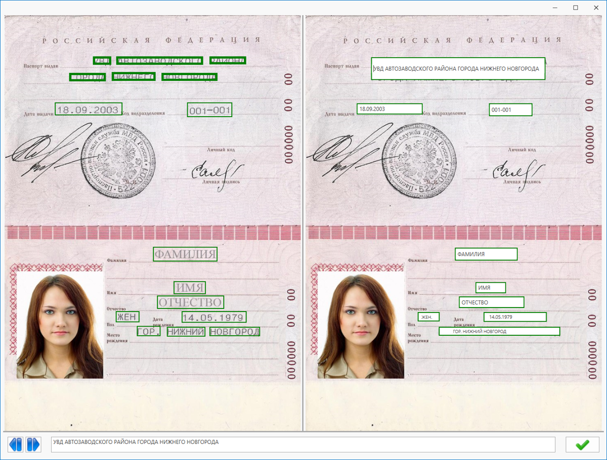

# Primo.AI.Server package description

The **Primo.AI.Server** package provides tools for interacting with the AI Server in RPA projects related to image processing.

## Overview

**Primo.AI.Server** is designed for integration with the Primo RPA AI Server solution. The library contains a set of components for developing RPA projects, the main task of which is to obtain recognition results of data in images using a trained model.

## Getting Started

To install the **Primo.AI.Server** package, use the Dependency Manager in Primo RPA Studio or visit [NuGet.org](https://www.nuget.org/).

### Installation Steps

1. **Open the Dependency Manager:**
   - In the main menu of Primo RPA Studio, select `Manage Dependencies`.
   - Or right-click in the project panel and choose the "Dependencies" option from the context menu.

2. In the opened window, go to the **NuGet.org** section and enter **System.Drawing.Common** in the search bar. This library is required for the correct installation of **Primo.AI.Server**.

3. Click on the funnel icon to display the list of available libraries.

4. Select **System.Drawing.Common** and click **Install**.

5. Click **Save**.

6. In the opened modal window, click **Install** and then **Close** to complete the installation.

7. Install **Primo.AI.Server** in the same way.

8. After installing the library, a group named **AI** will appear in the elements panel.

## Documentation

For more detailed information on setting up and using **Primo.AI.Server**, visit the [documentation on our website](https://docs.primo-rpa.com).

## Library Composition

The library includes the following features:

- **Primo.AI Server** — connects to the Primo RPA AI Server and also acts as a container for other components from the Primo.AI.Server library.
- **Create request** — sends a document recognition request to Primo RPA AI Server.
- **Get result** — retrieves the recognition result from Primo RPA AI Server, processed by a neural network model.
- **Validate document** — validates recognized data and allows users to adjust it.

To use the element, drag it into the working field of the Primo RPA Studio project.

## Element Properties

### General Properties

The following properties are common across multiple elements and are defined under the **General** section:

- **Continue on exception**: The script will continue running even if an error occurs during the execution of the element.
- **Disable logging**: Allows disabling logging in the console (only for this element). This is useful, for example, if the element handles confidential data. There is also an option to enable/disable logging centrally for all new elements added to the project. To do this, go to `File > Settings > General > Elements` and set the desired value in the `Disable logging for new elements` checkbox.
- **Name**: The name of the element, which is displayed in its header and in the log. For convenience, the element name can be changed within the process, for example, when multiple identical elements are used.
- **Screenshot on error**: A screenshot will be taken if an error occurs.
- **Screenshot on finish**: Allows taking a screenshot upon the element's completion. All screenshots are saved in the `.Screenshots` folder, which is automatically created inside the process folder.
- **Wait after (ms)**: Pause after the element is executed.
- **Wait before (ms)**: Adds a pause before the element is executed.

### "Primo.AI Server" Element

Connects to the Primo RPA AI Server service. The element acts as a container for other components working with Primo RPA AI Server, namely:

- **Create request** element;
- **Get result** element.

It includes the following properties:

1. **Server**:
   - Server — Server address. Example: `https://ip:port/`
   - Time-out — The maximum waiting time for Server actions, specified in milliseconds. The default is 30000.

### "Create request" Element

Sends a document recognition request to Primo RPA AI Server. Before starting work, you need to prepare an image that meets the [requirements for inference images](https://docs.primo-rpa.ru/primo-rpa/primo-rpa-ai-server/other/inference-quality-requirements).

It includes the following properties:

1. **Output**:
   - Result — The name of the variable where the request ID on the Server will be saved. The ID is generated automatically. Later, it can be used in the **Get result** element.
2. **Process**:
   - Document — The path to the document for recognition. For example, create a folder `Data` in the RPA project, place the file there, and specify the path in this property: `System.IO.Path.Combine(_Workflow.ProjectPath,"Data","file_name.extension")`. This field is required.
   - Model type — The name of the model type that will process the document. It must match the name in **Primo RPA AI Server**, case-sensitive. Example: `torg12`.

### "Get result" Element

Retrieves the document processing result from Primo RPA AI Server. The result is saved into the variable specified by the user in the element properties.

It includes the following properties:

1. **Output**:
   - Result — The name of the variable where the document processing result will be saved.
2. **Process**:
   - Request key — The request ID to Primo RPA AI Server. It can be obtained from the result of the **Create request** element. This field is required.

### "Validate document" Element

Validates the recognized document result. The recognition result in this context is a variable obtained using the **Get result** element. The **Validate document** element validates the content of this variable and saves the validation result into a new variable of the same data type. During validation, a dialog window opens with the document image and recognized fields:
   - Successfully recognized blocks are highlighted in green.
   - Blocks requiring attention are highlighted in yellow or red.

You need to check the "Minimize Studio" parameter in the [application settings](https://docs.primo-rpa.com/primo-studio/settings). If the Studio is not minimized, minimize the application manually to see the validation window.

The validation window allows you to change data that requires correction. To do this, select the desired block on the image and adjust the data in the block or in the bottom panel. You can also use the buttons on the left of the editing panel to navigate between blocks.

To finish editing, click the button .

The element includes the following properties:

1. **Output**:
   - Processed result — The name of the variable where the validated recognition result will be saved.
2. **Process** (required):
   - Document — The path to the file being processed. This field is required.
   - Recognition result — The name of the variable containing the document recognition result.

## Feedback

If you have any questions or suggestions, please contact us at [support@primo-rpa.ru](mailto:support@primo-rpa.ru).
