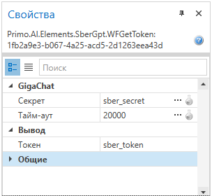
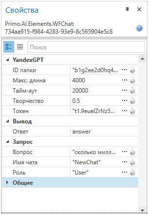

# Описание пакета Primo.AI

Пакет **Primo.AI** предоставляет инструменты для работы с внешними большими языковыми моделями (YandexGPT, GigaChat) — формирование запросов и получение ответов в синхронном и асинхронном режимах.

## Общие сведения

**Primo.AI** — это библиотека, интегрируемая в проекты с помощью Primo RPA Studio, предназначенная для автоматизации взаимодействия с чат-ботами на основе языковых моделей. Поддерживает отправку и получение данных от сервисов YandexGPT и GigaChat.

## Инструкции по началу работы

Чтобы установить пакет **Primo.AI**, воспользуйтесь Менеджером зависимостей в Primo RPA Studio или посетите [NuGet.org](https://www.nuget.org/).

### Шаги для установки

1. **Откройте Менеджер зависимостей:**
   - В главном меню Primo RPA Studio выберите `Управление зависимостями`.
   - Или щелкните правой кнопкой в панели проекта и выберите в отобразившемся меню пункт «Зависимости».

2. В открывшемся окне перейдите в раздел **NuGet.org** и введите **Primo RPA** в строку поиска.

3. Нажмите на значок с воронкой для отображения списка доступных библиотек. Найдите **Primo.AI** и нажмите **Установить**.

4. Нажмите **Сохранить**. 

5. В открывшемся модальном окне нажмите **Установить** и затем **Закрыть** для завершения установки. Пакет будет добавлен в ваш проект.

6. После установки библиотеки в панели элементов появятся группы **GigaChat** и **YandexGPT**.

## Документация

Для более подробной информации о настройке и использовании **Primo.AI** посетите [документацию на нашем сайте](https://docs.primo-rpa.ru/primo-rpa/g_elements/el_extra/ai).

## Состав библиотеки

Библиотека включает в себя следующие возможности:

- **GigaChat**:
   - Вопрос в чат
   - Получить токен

- **YandexGPT**:
  - Вопрос в чат
  - Задать вопрос
  - Создать чат

Для использования элемента необходимо перетащить его в рабочее поле проекта Primo RPA Studio.

## Примеры использования Primo.AI

### Заполнение свойств для получения токена GigaChat

### Заполнение свойств для создания чата YandexGPT

## Свойства элементов библиотеки

### Общие

Раздел **Общие** есть у каждого элемента, в него входят следующие свойства:

- Наименование
- Отключение логирования
- Пауза до/после
- Продолжение при ошибке
- Скриншот завершения
- Скриншот ошибки
- Тайм-аут

С описанием общих свойств можно ознакомиться на нашем сайте [здесь](https://docs.primo-rpa.ru/primo-rpa/primo-rpa-studio/process/elements).

### GigaChat

#### Элемент "Получить токен"

 Позволяет получить токен для работы с сервисом GigaChat. Для получения токена в свойствах элемента  потребуется указать [авторизационные данные клиента](https://docs.primo-rpa.ru/primo-rpa/primo-rpa-studio/settings/ai). Включает в себя следующие свойства:

1. **GigaChat** (обязательно для заполнения):
   - Секрет – название переменной с авторизационными данными клиента.
   - Тайм-аут – максимальное время ожидания выполнения запроса. Указывается в миллисекундах, по умолчанию 20000.
2. **Вывод**:
   - Токен – название переменной для хранения полученного токена GigaChat. Токен действует в течение 30-ти минут с момента выпуска.

#### Элемент "Вопрос в чат"

Позволяет отправить вопрос в сервис GigaChat. Для успешной отправки вопроса сначала следует получить токен. Токен действует в течение 30-ти минут, после чего его потребуется обновить. Включает в себя следующие свойства:

1. **GigaChat** (обязательно для заполнения):
   - Тайм-аут — максимальное время ожидания выполнения запроса. Указывается в миллисекундах, по умолчанию 20000.
   - Творчество — степень креативности (по умолчанию 0.5).
2. **Вывод**:
   - Ответ — переменная для хранения ответа GigaChat.
3. **Запрос** (обязательно для заполнения):
   - Вопрос — текст вопроса.
   - Роль — имя роли в чате. По умолчанию `user`.
   - Токен — токен запроса. Указывается в виде переменной или константы.

Чтобы просмотреть ответ GigaChat, установите [точку останова](https://docs.primo-rpa.ru/primo-rpa/primo-rpa-studio/process/debug) и запустите [отладку](https://docs.primo-rpa.ru/primo-rpa/primo-rpa-studio/process/debug) процесса. На панели Вывод откройте текущее значение переменной.

### Раздел "YandexGPT"

Перечисленные ниже элементы добавляются в рабочую область внутри элемента **Создать чат**. Элемент создает чат с генеративной языковой моделью YandexGPT. В режиме чата вы можете переписываться с моделью, уточняя задания и дополняя предыдущие реплики. Контекст общения передается в каждом сообщении и сохраняется в течение сессии, пока вы явно не начнете новую сессию.

Стартовый вопрос указывается в свойствах элемента Создать чат, ответ бота сохраняется в строковую переменную. 

Для успешного создания чата вам потребуется знать [ID папки в Yandex Cloud и IAM-токен](https://docs.primo-rpa.ru/primo-rpa/primo-rpa-studio/settings/ai).

Элемент включает в себя следующие свойства:

1. **YandexGPT** (обязательно для заполнения):
   - ID папки — идентификатор папки в Yandex Cloud. Значение в виде переменной или константы.
   - Макс. длина — максимальная длина пары «запрос-ответ» в символах. По умолчанию 4000. Значение не должно превышать 4700 символов.
   - Тайм-аут — максимальное время ожидания выполнения запроса. Указывается в миллисекундах, по умолчанию 20000.
   - Творчество — степень креативности (по умолчанию 0.5).
   - Токен — IAM-токен запроса, указывается в виде переменной или константы. Время жизни IAM-токена не превышает 12-ти часов, но рекомендуется запрашивать его каждый час.
2. **Вывод**:
   - Ответ — переменная для хранения ответа.
3. **Запрос** (обязательно для заполнения):
   - Вопрос — текст вопроса.
   - Имя чата — имя чата. По умолчанию `NewChat`.
   - Роль — имя роли в чате. По умолчанию `User`.

#### Элемент "Вопрос в чат"

Отправляет вопрос в чат с YandexGPT. Используйте этот элемент, если вам необходимо поддерживать диалог с чат-ботом и отправлять запросы в синхронном режиме. Включает в себя следующие свойства:

1. **Вывод**:
   - Ответ — переменная для хранения ответа.
2. **Запрос**:
   - Вопрос — текст вопроса. Обязательно для заполнения.

#### Элемент "Задать вопрос"

Задает вопрос YandexGPT в асинхронном режиме. Используйте этот элемент, если ваш вопрос не требует срочного ответа. В асинхронном режиме генерация текста займет больше времени, но ответ будет качественнее и дешевле. Включает в себя следующие свойства:

1. **YandexGPT** (обязательно для заполнения):
   - ID папки — идентификатор папки в Yandex Cloud. Значение в виде переменной или константы.
   - Макс. длина — максимальная длина пары «запрос-ответ» в символах. По умолчанию 4000. Значение не должно превышать 4700 символов.
   - Тайм-аут — максимальное время ожидания выполнения запроса. Указывается в миллисекундах, по умолчанию 20000.
   - Творчество — степень креативности (по умолчанию 0.5).
   - Токен — IAM-токен запроса, указывается в виде переменной или константы. Время жизни IAM-токена не превышает 12-ти часов, но рекомендуется запрашивать его каждый час.
2. **Вывод**:
   - Ответ — переменная для хранения ответа.
3. **Запрос**:
   - Вопрос — текст вопроса. Обязательно для заполнения.

## Обратная связь

Если у вас возникли вопросы или предложения, пожалуйста, свяжитесь с нами по адресу [support@primo-rpa.ru](mailto:support@primo-rpa.ru).
