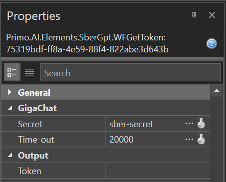
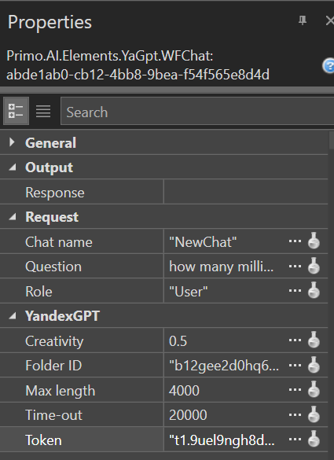

# Package Description Primo.AI

The **Primo.AI** package provides tools for working with external large language models (YandexGPT, GigaChat) — forming queries and receiving responses in both synchronous and asynchronous modes.

## General Information

**Primo.AI** is a library that integrates into projects via Primo RPA Studio, designed for automating interactions with chatbots based on language models. It supports sending and receiving data from the YandexGPT and GigaChat services.

## Getting Started

To install the **Primo.AI** package, use the Dependency Manager in Primo RPA Studio or visit [NuGet.org](https://www.nuget.org/).

### Installation Steps

1. **Open the Dependency Manager:**
   - In the main menu of Primo RPA Studio, select `Manage Dependencies`.
   - Or right-click on the project panel and choose "Dependencies" from the context menu.

2. In the opened window, go to the **NuGet.org** section and type **Primo RPA** into the search bar.

3. Click the funnel icon to display the list of available libraries. Find **Primo.AI** and click **Install**.

4. Click **Save**.

5. In the modal window that appears, click **Install** and then **Close** to complete the installation. The package will be added to your project.

6. After installing the library, the **GigaChat** and **YandexGPT** groups will appear in the tool panel.

## Documentation

For more detailed information on setting up and using **Primo.AI**, visit [our documentation](https://docs.primo-rpa.com).

## Library Features

The library includes the following capabilities:

- **GigaChat**:
   - Chat question
   - Get token

- **YandexGPT**:
  - Chat question
  - Ask question
  - Begin chat

To use an element, drag it into the workspace of the Primo RPA Studio project.

## Primo.AI Usage Examples

### Setting up Properties to Get GigaChat Token

### Setting up Properties for Creating YandexGPT Chat

## Library Element Properties

### General Properties

The following properties are common across multiple elements and are defined under the **General** section:

- **Continue on exception**: The script will continue running even if an error occurs during the execution of the element.
- **Disable logging**: Allows disabling logging in the console (only for this element). This is useful, for example, if the element handles confidential data. There is also an option to enable/disable logging centrally for all new elements added to the project. To do this, go to `File > Settings > General > Elements` and set the desired value in the `Disable logging for new elements` checkbox.
- **Name**: The name of the element, which is displayed in its header and in the log. For convenience, the element name can be changed within the process, for example, when multiple identical elements are used.
- **Screenshot on error**: A screenshot will be taken if an error occurs.
- **Screenshot on finish**: Allows taking a screenshot upon the element's completion. All screenshots are saved in the `.Screenshots` folder, which is automatically created inside the process folder.
- **Wait after (ms)**: Pause after the element is executed.
- **Wait before (ms)**: Adds a pause before the element is executed.

### GigaChat

#### "Get Token" Element

Allows getting a token to work with the GigaChat service. To obtain a token, the client's authorization data must be specified in the element properties. Includes the following properties:

1. **GigaChat** (required fields):
   - Secret – the name of the variable containing the client's authorization data.
   - Time-out – the maximum waiting time for the request to be processed, specified in milliseconds (default is 20000).
2. **Output**:
   - Token – the name of the variable to store the GigaChat token. The token is valid for 30 minutes after issuance.

#### "Chat Question" Element

Allows sending a question to the GigaChat service. To send a question successfully, you first need to get a token. The token is valid for 30 minutes and needs to be refreshed after expiration. Includes the following properties:

1. **GigaChat** (required fields):
   - Time-out – the maximum waiting time for the request to be processed, specified in milliseconds (default is 20000).
   - Creativity – creativity level (default is 0.5).
2. **Output**:
   - Response – a variable to store the GigaChat response.
3. **Request** (required fields):
   - Question – the text of the question.
   - Role – the name of the role in the chat (default is `user`).
   - Token – the request token specified as a variable or constant.

To view the GigaChat response, set a [breakpoint](https://docs.primo-rpa.com/primo-studio/debug) and run the [process debug](https://docs.primo-rpa.com/primo-studio/debug). Open the current value of the variable in the Output panel.

### YandexGPT Section

The following elements are added to the workspace within the **Begin Chat** element. This element initiates a chat with the YandexGPT generative language model. In chat mode, you can interact with the model, clarifying tasks and supplementing previous responses. The conversation context is passed in each message and persists throughout the session unless you explicitly start a new session.

The starting question is specified in the Begin Chat element properties, and the bot's response is saved in a string variable.

To create a successful chat, you will need to know the Folder ID in Yandex Cloud and the IAM-Token.

The element includes the following properties:

1. **YandexGPT** (required fields):
   - Folder ID – the identifier of the folder in Yandex Cloud, specified as a variable or constant.
   - Max length – the maximum length of the "request-response" pair in characters (default is 4000, should not exceed 4700 characters).
   - Time-out – the maximum waiting time for the request to be processed, specified in milliseconds (default is 20000).
   - Creativity – creativity level (default is 0.5).
   - Token – the IAM-Token for the request, specified as a variable or constant. The IAM-Token lifetime does not exceed 12 hours, but it is recommended to request it every hour.
2. **Output**:
   - Response – a variable to store the response.
3. **Request** (required fields):
   - Question – the text of the question.
   - Chat name – the chat name (default is `NewChat`).
   - Role – the name of the role in the chat (default is `User`).

#### "Chat Question" Element

Sends a chat question to YandexGPT. Use this element if you need to maintain a dialogue with the chatbot and send requests synchronously. Includes the following properties:

1. **Output**:
   - Response – a variable to store the response.
2. **Request**:
   - Question – the text of the question (required).

#### "Ask Question" Element

Asks a question to YandexGPT asynchronously. Use this element if your question does not require an immediate response. In asynchronous mode, text generation takes longer, but the response will be of higher quality and cheaper. Includes the following properties:

1. **YandexGPT** (required fields):
   - Folder ID – the identifier of the folder in Yandex Cloud, specified as a variable or constant.
   - Max length – the maximum length of the "request-response" pair in characters (default is 4000, should not exceed 4700 characters).
   - Time-out – the maximum waiting time for the request to be processed, specified in milliseconds (default is 20000).
   - Creativity – creativity level (default is 0.5).
   - Token – the IAM-Token for the request, specified as a variable or constant. The IAM-Token lifetime does not exceed 12 hours, but it is recommended to request it every hour.
2. **Output**:
   - Response – a variable to store the response.
3. **Request**:
   - Question – the text of the question (required).

## Feedback

If you have any questions or suggestions, please contact us at [support@primo-rpa.ru](mailto:support@primo-rpa.ru).
