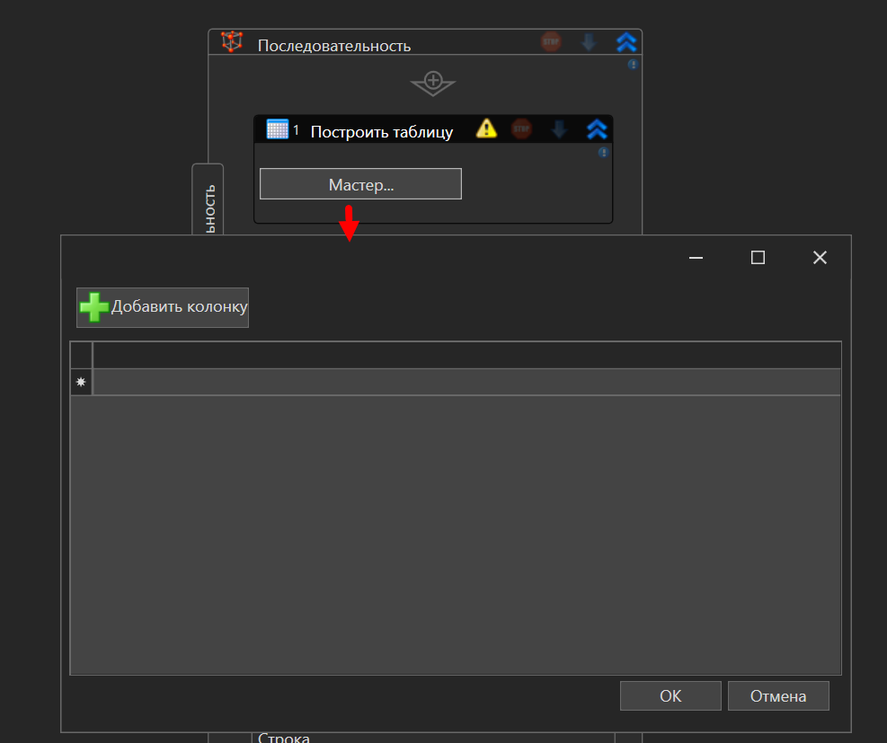
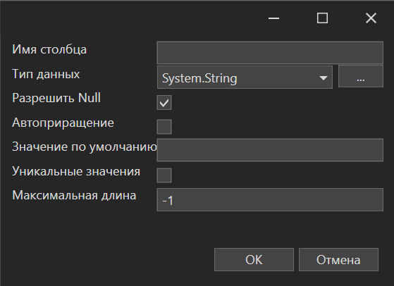
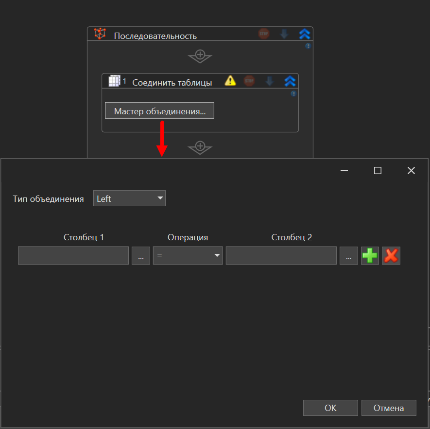

# Описание пакета Primo.Collections

Пакет **Primo.Collections** предоставляет набор активностей для работы с коллекциями (Collections) в .NET, позволяя пользователям легко манипулировать данными и таблицами в рамках проектов на базе Primo RPA.

## Общие сведения

**Primo.Collections** — это библиотека для работы с коллекциями в .NET и интеграции с процессами автоматизации в Primo RPA. Пакет предоставляет простые и эффективные инструменты для создания, объединения и изменения коллекций данных, что ускоряет выполнение рутинных задач.

## Инструкции по началу работы

Чтобы установить пакет **Primo.Collections**, воспользуйтесь Менеджером зависимостей в Primo RPA Studio или посетите [NuGet.org](https://www.nuget.org/).

### Шаги для установки

1. **Откройте Менеджер зависимостей:**
   - В главном меню Primo RPA Studio выберите `Управление зависимостями`.
   - Или щелкните правой кнопкой в панели проекта и выберите «Зависимости».

2. В открывшемся окне перейдите в раздел **NuGet.org** и введите **Primo RPA** в строку поиска.

3. Нажмите на значок фильтра для отображения списка доступных библиотек. Найдите **Primo.Collections** и нажмите **Установить**.

4. Нажмите **Сохранить**.

5. В модальном окне нажмите **Установить**, а затем **Закрыть** для завершения установки. Пакет будет добавлен в проект.

6. Элементы библиотеки будут находиться на панели элементов в группе **Данные** > **Таблицы**.

## Документация

Для подробной информации о настройке и использовании **Primo.Collections**, посетите [документацию на нашем сайте](https://docs.primo-rpa.ru/primo-rpa/g_elements/el_extra/els_collections).

## Состав библиотеки

Библиотека предоставляет следующие возможности:

- Построить таблицу
- Соединить таблицы
- Изменить значение
- Получить значение

Для использования элемента перетащите его в рабочую область проекта Primo RPA Studio.

## Свойства элементов библиотеки

### Общие

Раздел **Общие** присутствует у каждого элемента и включает следующие свойства:

- Наименование
- Отключение логирования
- Пауза до/после
- Продолжение при ошибке
- Скриншот завершения
- Скриншот ошибки
- Тайм-аут

Описание общих свойств доступно на [нашем сайте](https://docs.primo-rpa.ru/primo-rpa/primo-rpa-studio/process/elements).

### Элемент "Построить таблицу"

Элемент **Построить таблицу** производит создание новой таблицы на основе мастера. Для добавления таблицы необходимо нажать кнопку "Мастер" в панели элемента, после чего откроется форма создания таблицы:

По нажатию кнопки **Добавить колонку** откроется форма создания столбца, содержащая следующие параметры:

- Имя столбца — допускается только строковое значение.
- Тип данных — тип значений столбца.
- Разрешить Null — если чекбокс установлен, то в строки столбца можно добавлять значение Null.
- Автоприращение — только для типа данных Int32. Если чекбокс установлен, то значение столбца автоматически будет увеличиваться на 1 каждый раз при добавлении новой строки.
- Значение по умолчанию — значение по умолчанию для всех строк, добавляемых в столбец.
- Уникальные значение — если чекбокс установлен, то все строки в этом столбце должны иметь уникальные значения.
- Максимальная длина — максимальное количество символов в столбце. Значение по умолчанию: -1.

Для добавления новой строки необходимо нажать левой кнопкой мыши в области под таблицей. Удаление строки осуществляется с помощью клавиши **Delete**. Последнюю пустую строку удалить невозможно, однако она не будет отображаться в итоговой таблице.

Элемент включает следующие свойства:

1. **Вывод**:
   - Таблица — результирующая таблица. Обязательно для заполнения.

### Элемент "Получить значение"

Извлекает значение строки из таблицы DataTable в соответствии с указанным столбцом. Свойства:

1. **Вывод**:
   - Значение — значение, полученное из таблицы. Обязательно для заполнения.
2. **Обработка**:
   - Имя — название столбца.
   - Индекс — столбец таблицы DataTable. Если значение заполнено, то свойства **Имя** и **Индекс** игнорируются.
   - Столбец — номер столбца.
   - Строка — строка таблицы DataTable. Обязательно для заполнения.

### Элемент "Изменить значение"

Изменяет значение ячейки в таблице DataTable. Параметры указываются либо на панели элемента, либо в панели свойств. Свойства элемента:

1. **Обработка**:
   - Значение — значение, которое нужно присвоить ячейке указанного столбца. Обязательно для заполнения.
   - Имя — название столбца, значение которого следует обновить.
   - Индекс — номер столбца.
   - Строка — строка таблицы DataTable. Обязательно для заполнения.

### Элемент "Соединить таблицы"

Производит объединение двух таблиц по указанным столбцам в соответствии с выбранным типом оператора JOIN.

Нажмите кнопку **Мастер объединения**, чтобы указать необходимые столбцы и выбрать тип объединения (JOIN).

**Типы объединения**:
- Inner — используется по умолчанию. Объединяет строки из двух таблиц, если в связующих столбцах этих таблиц содержатся одинаковые значения. Любые строки, не соответствующие правилу объединения, будут удалены из результирующей таблицы.
- Left — возвращает все строки из Таблицы 1, которая является левой, и только те значения из Таблицы 2, которые соответствуют правилу объединения. Если для строки из Таблицы 1 нет соответствующей строки в Таблице 2, то в результирующей таблице подставятся значения NULL.
- Full — возвращает все строки из обеих таблиц, дополняя их значениями NULL там, где соответствующие строки отсутствуют в другой таблице.

Параметр Операция определяет отношение между столбцами. Доступные значения:
* `=` — равно.
* `!=` — не равно.
* `>` — больше, чем...
* `<` — меньше чем...
* `>=` — больше или равно.
* `<=` — меньше или равно.

Свойства элемента:

1. **Вывод**:
   - Таблица — переменная типа DataTable с результирующей таблицей. Обязательно для заполнения.
2. **Обработка** (обязательно для заполнения):
   - Таблица 1
   - Таблица 2

## Обратная связь

Если у вас возникли вопросы или предложения, свяжитесь с нами по адресу [support@primo-rpa.ru](mailto:support@primo-rpa.ru).
