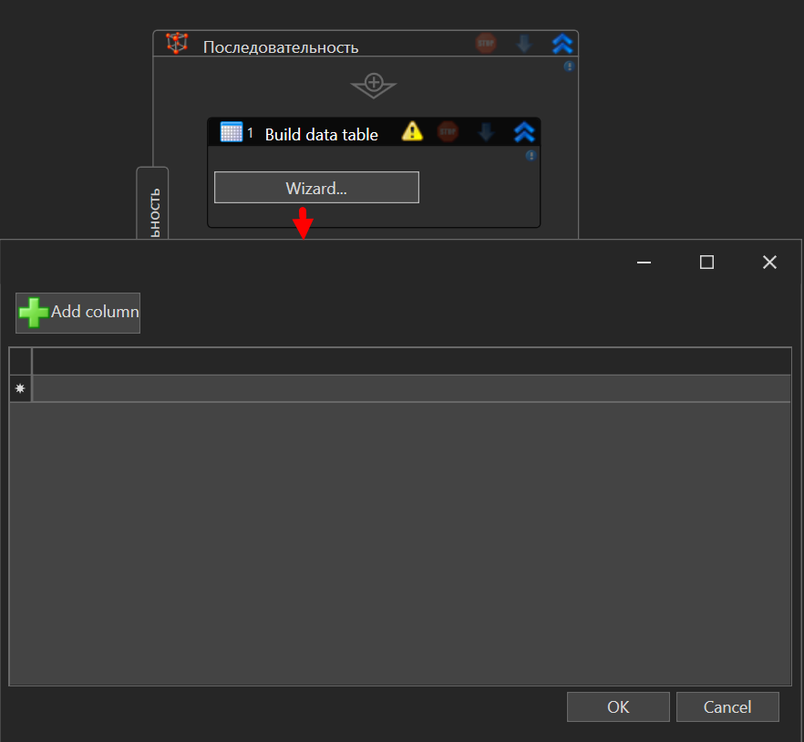
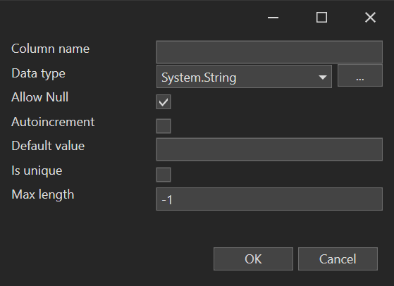
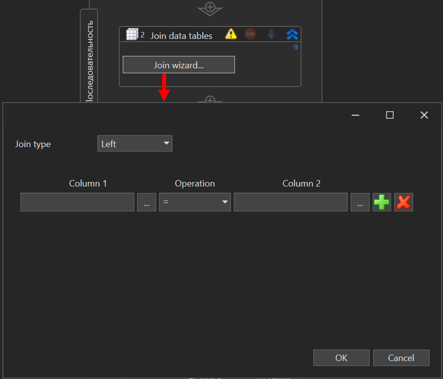

# Package Description for Primo.Collections

The **Primo.Collections** package provides a set of activities for working with collections (Collections) in .NET, allowing users to easily manipulate data and tables within Primo RPA-based projects.

## Overview

**Primo.Collections** is a library for working with collections in .NET and integrating them with automation processes in Primo RPA. The package offers simple and efficient tools for creating, merging, and modifying data collections, speeding up the execution of routine tasks.

## Getting Started

To install the **Primo.Collections** package, use the Dependency Manager in Primo RPA Studio or visit [NuGet.org](https://www.nuget.org/).

### Installation Steps

1. **Open the Dependency Manager:**
   - In the main menu of Primo RPA Studio, select `Manage Dependencies`.
   - Or right-click on the project panel and choose "Dependencies" from the context menu.

2. In the opened window, go to the **NuGet.org** section and type **Primo RPA** into the search bar.

3. Click the funnel icon to display the list of available libraries. Find **Primo.Collections** and click **Install**.

4. Click **Save**.

5. In the modal window that appears, click **Install** and then **Close** to complete the installation. The package will be added to your project.

6. The library elements will be available in the **Data** > **Tables** group on the elements panel.

## Documentation

For more detailed information on setting up and using **Primo.Collections**, visit [our documentation](https://docs.primo-rpa.com).

## Library Features

The library includes the following capabilities:

- Build data table
- Join data tables
- Update row item
- Get row item

To use an element, drag it into the workspace of the Primo RPA Studio project.

## Element Properties

### General Properties

The following properties are common across multiple elements and are defined under the **General** section:

- **Continue on exception**: The script will continue running even if an error occurs during the execution of the element.
- **Disable logging**: Allows disabling logging in the console (only for this element). This is useful, for example, if the element handles confidential data. There is also an option to enable/disable logging centrally for all new elements added to the project. To do this, go to `File > Settings > General > Elements` and set the desired value in the `Disable logging for new elements` checkbox.
- **Name**: The name of the element, which is displayed in its header and in the log. For convenience, the element name can be changed within the process, for example, when multiple identical elements are used.
- **Screenshot on error**: A screenshot will be taken if an error occurs.
- **Screenshot on finish**: Allows taking a screenshot upon the element's completion. All screenshots are saved in the `.Screenshots` folder, which is automatically created inside the process folder.
- **Wait after (ms)**: Pause after the element is executed.
- **Wait before (ms)**: Adds a pause before the element is executed.

### Build data table

The **Build data table** element creates a new table based on a wizard. To add a table, click the "Wizard" button in the element panel, which will open the table creation form:

Clicking **Add column** will open the column creation form with the following parameters:

- Column name — only string values are allowed.
- Data type — the column data type.
- Allow Null — if the checkbox is set, null values can be added to the column.
- Autoincrement — only for the Int32 data type. If the checkbox is set, the column value will automatically increase by 1 every time a new row is added.
- Default value — the default value for all rows added to the column.
- Is unique — if the checkbox is set, all rows in this column must have unique values.
- Max length — the maximum number of characters in the column. Default value: -1.

To add a new row, click in the area below the table. Rows can be deleted using the **Delete** key. The last empty row cannot be deleted, but it will not appear in the final table.

The element includes the following properties:

1. **Output**:
   - Table — the resulting table. Required.

### Get row item

Extracts a row value from a DataTable according to the specified column. Properties:

1. **Output**:
   - Value — the value retrieved from the table. Required.
2. **Processing**:
   - Name — the column name.
   - Index — the DataTable column. If this value is filled, the **Name** and **Index** properties are ignored.
   - Column — the column number.
   - Row — the DataTable row. Required.

### Update row item

Updates the cell value in a DataTable. Parameters can be specified either on the element panel or in the property panel. Element properties:

1. **Processing**:
   - Value — the value to be assigned to the specified column cell. Required.
   - Name — the name of the column whose value should be updated.
   - Index — the column number.
   - Row — the DataTable row. Required.

### Join data tables

Merges two tables by the specified columns according to the selected JOIN operator.

Click the **Join wizard** button to specify the required columns and choose the type of join (JOIN).

**Join types**:
- Inner — used by default. Joins rows from both tables if the join columns contain the same values. Any rows not matching the join condition will be removed from the result table.
- Left — returns all rows from Table 1, which is the left table, and only the values from Table 2 that match the join condition. If there is no corresponding row in Table 2 for a row in Table 1, the result table will have null values.
- Full — returns all rows from both tables, filling in null values where corresponding rows are missing from the other table.

The **Operation** parameter defines the relationship between columns. Available values:
* `=` — equals.
* `!=` — not equals.
* `>` — greater than.
* `<` — less than.
* `>=` — greater than or equal.
* `<=` — less than or equal.

Element properties:

1. **Output**:
   - Table — the DataTable variable containing the result table. Required.
2. **Processing** (required):
   - Table 1
   - Table 2

## Feedback

If you have any questions or suggestions, please contact us at [support@primo-rpa.ru](mailto:support@primo-rpa.ru).
