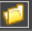

# Описание пакета Primo.Office.OdfOxml.Linux

Пакет **Primo.Office.OdfOxml.Linux** предоставляет набор элементов для создания и редактирования документов в формате OpenDocument на платформе Linux.

## Общие сведения

**Primo.Office.OdfOxml.Linux** — это библиотека, предназначенная для работы с документами и таблицами форматов ODF и OXML. Она предоставляет широкий набор функций для управления содержимым, такими как вставка изображений, таблиц и текста, замена и удаление текста, работа с цветом шрифта и фона, поиск и копирование текста, а также экспорт документов. Для таблиц поддерживается работа с листами (добавление, копирование, переименование, удаление), редактирование диапазонов и ячеек, вставка диаграмм, формул и фильтров, сортировка данных и обновление сводных таблиц. Библиотека позволяет сохранять документы в различных форматах, включая PDF.

## Инструкции по началу работы

Чтобы установить пакет **Primo.Office.OdfOxml.Linux**, воспользуйтесь Менеджером зависимостей в Primo RPA Studio или посетите [NuGet.org](https://www.nuget.org/).

### Шаги для установки

1. **Откройте Менеджер зависимостей:**
   - В главном меню Primo RPA Studio выберите `Управление зависимостями`.
   - Или щелкните правой кнопкой в панели проекта и выберите в отобразившемся меню пункт «Зависимости».

2. В открывшемся окне перейдите в раздел **NuGet.org** и введите **Primo RPA** в строку поиска.

3. Нажмите на значок с воронкой для отображения списка доступных библиотек. Найдите **Primo.Office.OdfOxml.Linux** и нажмите **Установить**.

4. Нажмите **Сохранить**. 

5. В открывшемся модальном окне нажмите **Установить** и затем **Закрыть** для завершения установки. Пакет будет добавлен в ваш проект.

## Документация

Для более подробной информации о настройке и использовании **Primo.Office.OdfOxml.Linux** посетите [документацию на нашем сайте](https://docs.primo-rpa.ru).

## Состав библиотеки

Библиотека включает в себя следующие возможности:

- **ODF/OXML - Документы**:
   - Вставить изображение
   - Вставить таблицу
   - Вставить текст
   - Добавить строку таблицы
   - Документ ODF
   - Заменить текст
   - Записать в ячейку таблицы
   - Копировать в буфер обмена
   - Найти текст
   - Прочитать таблицу
   - Сохранить документ
   - Удалить текст
   - Цвет фона шрифта
   - Цвет шрифта
   - Читать текст
   - Экспортировать документ

- **ODF/OXML - Таблицы**:
  - Страницы:
      - Добавить страницу
      - Копировать страницу
      - Переименовать страницу
      - Список страниц
      - Удалить страницу
  - Вставить диаграмму
  - Вставить колонки
  - Вставить строки
  - Выделить диапазон
  - Записать в ячейку
  - Записать диапазон
  - Записать формулу в ячейку
  - Изменить шрифт
  - Изменить ячейки
  - Копировать диапазон
  - Найти на странице
  - Найти начальную/конечную строку
  - Найти ячейку
  - Обновить сводные таблицы
  - Пересчитать формулы
  - Редактировать диаграмму
  - Сортировать диапазон
  - Сохранить документ
  - Сохранить как PDF
  - Таблица ODF
  - Удалить диапазон
  - Удалить колонки
  - Удалить строки
  - Фильтр диапазона
  - Формула из ячейки
  - Чтение диапазона
  - Чтение из ячейки
  - Чтение колонки
   
Для использования элемента необходимо перетащить его в рабочее поле проекта Primo RPA Studio.

## Примеры использования Primo.Office.OdfOxml.Linux

### Пример ввода текста

```csharp
Primo.Office.OdfOxml.Linux.WordApp app = Primo.Office.OdfOxml.Linux.WordApp.Init(wf, "fileName");
app.AppendText(text, [selStart]);
app.AppendText(text, bookmark);
```

### Пример записи в ячейку таблицы

```csharp
Primo.Office.OdfOxml.Linux.WordApp app = Primo.Office.OdfOxml.Linux.WordApp.Init(wf, "fileName");  
app.WriteTableCell(idx, data, row, col);  
```

### Пример вставки изображения

```csharp
Primo.Office.OdfOxml.Linux.WordApp app = Primo.Office.OdfOxml.Linux.WordApp.Init(wf, "fileName");
app.InsertPicture(pic, bookmark);
app.InsertPicture(pic, pos);
```

### Пример обновления сводной таблицы

```csharp
Primo.Office.OdfOxml.Linux.ExcelApp app = Primo.Office.OdfOxml.Linux.ExcelApp.Init(wf, [file]);  
app.RefreshPivotTables();  
```

### Пример сохранения таблицы в формате PDF

```csharp
Primo.Office.OdfOxml.Linux.ExcelApp app = Primo.Office.OdfOxml.Linux.ExcelApp.Init(wf, [file]);
app.ExportToPdf(path, replaceExisting, minQuality, [start], [end]);
```

### Пример редактирования диаграммы

```csharp
Primo.Office.OdfOxml.Linux.ExcelApp app =  Primo.Office.OdfOxml.Linux.ExcelApp.Init(wf, "fileName");  
app.ChartSetRange(chart, "A1:D12", false);  
app.ChartSetTitle(chart, "Диаграмма состояний", true);  
app.ChartSetAxTitle(chart, Model.Excel.AxisType.Category, "Высота, метры", true);  
app.ChartSetAxBounds(chart, Model.Excel.AxisType.Value, -5.5, 350.25);  
app.ChartSetLegend(chart, true);  
app.ChartSetDataLabels(chart, true);  
```

## Общие свойства элементов библиотеки

Раздел **Общие** есть у каждого элемента, в него входят следующие свойства:

- Наименование
- Отключение логирования
- Пауза до/после
- Продолжение при ошибке
- Скриншот завершения
- Скриншот ошибки
- Тайм-аут

С описанием общих свойств можно ознакомиться на нашем сайте [здесь](https://docs.primo-rpa.ru/primo-rpa/primo-rpa-studio/process/elements).

## Раздел "ODF/OXML - Документы"

Все перечисленные ниже компоненты добавляются в рабочую область внутри элемента **Документ ODF**. Это компонент, производящий подключение к приложению ODF Документы. Элемент **Документ ODF** включает в себя следующие свойства:

- **Текст**: 
   - Массив байтов - массив байтов документа.
   - Пароль — пароль от файла при наличии.
   - Пароль (зашифрованный) — защищенный пароль от файла.
   - Путь к файлу – По кнопке  можно указать путь к файлу в окне Проводника.

### Компонент "Вставить изображение"

Производит вставку изображения в документ Word. Путь до документа указывается в контейнере **Документ ODF**. По умолчанию изображение вставляется в конец текста. Чтобы определить другое положение, необходимо заполнить либо свойство **Закладка**, либо **Позиция**. Включает в себя следующие свойства:

1. **Текст**:
   - Закладка – имя закладки, определяющей начало записи. Если закладка не указана, вставка производится в конец текста.
   - Изображение – название переменной, которая содержит изображение для вставки. Обязательно для заполнения.
   - Позиция – позиция для вставки изображения, указывается в символах. Позицию можно указать, например, относительно искомого слова в тексте. Для этого сначала найдите слово в документе, а затем укажите количество символов до или после него.

### Компонент "Вставить таблицу"

Компонент, вставляющий таблицу в документ. Работает корректно только внутри контейнера. Включает в себя следующие свойства:

1. **Текст**:
   - Данные
   - Закладка — имя закладки, определяющей начало записи. Если не указано, запись производится в конец текста.
   - Таблица

### Компонент "Вставить текст"

Компонент, производящий запись данных в документ Word. Работает корректно только внутри контейнера. Включает в себя следующие свойства:

1. **Текст**:
   - Закладка — имя закладки, определяющей начало записи. Если не указано, запись производится в конец текста.
   - Начало — индекс начала вставки.
   - Текст — данные, вводимые в документ.

### Компонент "Добавить строку таблицы"

Элемент добавляет строку к таблице. Работает корректно только внутри контейнера **Документ ODF**. Включает в себя следующие свойства:

1. **Текст**:
   - Данные — данные строки. Пример: `new List<string>(){"a","b"}`
   - Индекс — обязательно для заполнения. Порядковый номер таблицы (отсчет ведется с нуля).
   - Строка — данные строки. Пример: `table.NewRow()`

### Компонент "Заменить текст"

Заменяет все вхождения исходного текста на новый. Работает корректно только внутри контейнера **Документ ODF**. Включает в себя следующие свойства:

1. **Текст**:
   - Исходный текст
   - Новый текст — обязательно для заполнения.

### Компонент "Записать в ячейку таблицы"

Записывает текст в ячейку таблицы. Работает корректно только внутри контейнера **Документ ODF**. Включает в себя следующие свойства:

1. **Текст**:
   - Данные — данные ячейки. Пример: `"строка"`
   - Индекс — обязательно для заполнения. Порядковый номер таблицы (отсчет ведется с нуля). 
   - Колонка — Индекс колонки (отсчет ведется с нуля). 
   - Строка — индекс строки (отсчет ведется с нуля). 

### Компонент "Копировать в буфер обмена"

Копирует текст в буфер обмена. Работает корректно только внутри контейнера **Документ ODF**. Включает в себя следующие свойства:

1. **Текст**:
   - Длина — длина текста.
   - Начало — начало текста.

### Компонент "Найти текст"

Ищет вхождение заданного текста в документ. Работает корректно только внутри контейнера **Документ ODF**. Включает в себя следующие свойства:

1. **Текст**:
   - Переменная — переменная для хранения индекса первого вхождения текста.
   - Переменная (массив) — переменная для хранения массива индексов вхождения текста. 
   - Текст — искомый текст.

### Компонент "Прочитать таблицу"

Читает таблицу из документа и сохраняет в переменную. Путь до файла указывается в контейнере **Документ ODF**. Включает в себя следующие свойства:

1. **Вывод**:
   - Данные — переменная для хранения прочитанной таблицы. Отличается от свойства **Таблица** только типом данных.
   - Таблица — переменная для хранения прочитанной таблицы.

2. **Текст**:
   - Индекс — обязательно для заполнения. Порядковый номер таблицы в документе.

### Компонент "Сохранить документ"

Сохраняет текущее состояние файла. Если в свойствах данного элемента не указан путь к файлу, то сохранен будет файл, открытый в рамках контейнера **Документ ODF**. Включает в себя следующие свойства:

1. **Текст**:
   - Путь к файлу – путь к ODF-файлу. По кнопке  можно указать путь к файлу в окне Проводника.

### Компонент "Удалить текст"

Удаляет текст заданной длины. Работает корректно только внутри контейнера **Документ ODF**. Включает в себя следующие свойства:

1. **Текст**:
   - Длина — длина текста (по умолчанию - до конца документа). 
   - Начало — индекс символа начала текста (отсчет ведется с нуля, значение по умолчанию - ноль). 

### Компонент "Цвет фона шрифта"

Обрабатывает цвет фона текста документа. Работает корректно только внутри контейнера **Документ ODF**. Включает в себя следующие свойства:

1. **Вывод**:
   - Цвет — Переменная для сохранения текущего цвета фона. Если фрагмент имеет несколько цветов фона, устанавливается `System.Drawing.Color.Transparent`.
2. **Текст**:
   - Длина — длина текста (по умолчанию - до конца документа). 
   - Изменить цвет — признак изменения цвета. Пример: `true`
   - Начало — индекс символа начала текста (отсчет ведется с нуля, значение по умолчанию - ноль). 
   - Новый цвет —  устанавливаемый цвет фона. Пример: `System.Drawing.Color.LightBlue`.

### Компонент "Цвет шрифта"

Обрабатывает цвет текста документа. Работает корректно только внутри контейнера **Документ ODF**. Включает в себя следующие свойства:

1. **Вывод**:
   - Цвет — переменная для сохранения текущего цвета шрифта. Если фрагмент имеет несколько цветов шрифта, устанавливается System.`Drawing.Color.Transparent`.
2. **Текст**:
   - Длина — длина текста (по умолчанию - до конца документа). 
   - Изменить цвет — признак изменения цвета. Пример: `true`
   - Начало — индекс символа начала текста (отсчет ведется с нуля, значение по умолчанию - ноль). 
   - Новый цвет —  устанавливаемый цвет шрифта. Пример: `System.Drawing.Color.LightBlue`.

### Компонент "Экспортировать документ"

Экспортирует ODF-файл в указанный формат. На данный момент поддерживает экспорт только в PDF. Включает в себя следующие свойства:

1. **Текст**:
   - Путь к файлу — по кнопке  можно указать путь к файлу в окне Проводника.
   - Формат — тип формата. На данный момент только PDF.

### Компонент "Читать текст"

Считывает данные из документа и сохраняет результат в переменную. Путь до файла указывается в контейнере **Документ ODF**. Включает в себя следующие свойства:

1. **Текст**:
   - Длина — длина выделения текта.
   - Начало — начало выделения текста.
   - Переменная — переменная для хранения результатов чтения. Обязательно для заполнения.

## Раздел "ODF/OXML - Таблицы"

Все перечисленные ниже компоненты добавляются в рабочую область внутри элемента **Таблица ODF**. Элемент устанавливает подключение к приложению, работающему с таблицами ODF. Путь до файла с таблицей указывается в свойствах элемента. Если данный файл отсутствует, будет создан новый. Элемент **Таблица ODF** включает в себя следующие свойства:

1. **Текст**:
   - Массив байтов — массив байтов документа.
   - Пароль — пароль от файла при наличии.
   - Пароль (зашифрованный) — защищенный пароль от файла.
   - Проверять файл — определяет, нужно ли использовать проверку на наличие указанного файла. По умолчанию проверка не используется.
   - Путь к файлу — по кнопке  можно указать путь к файлу в окне Проводника.

---

### Подраздел "Страницы"

#### Компонент "Добавить страницу"

Создает новую страницу в ODF-таблице. Путь до файла указывается в контейнере **Таблица ODF**. Включает в себя следующие свойства:

1. **Таблица**:
   - Индекс — порядковый номер страницы. Нумерация начинается с нуля.
   - Название — название новой страницы. Обязательно для заполнения

#### Компонент "Копировать страницу"

Копирует страницу для вставки в файл-источник или внешний ODF-документ. Путь до файла указывается в контейнере **Таблица ODF**.  Включает в себя следующие свойства:

1. **Таблица**:
   - Имя — название копируемой страницы. Обязательно для заполнения.
   - Индекс — порядковый номер копируемой страницы. Нумерация начинается с нуля.
   - Новая страница — название страницы для вставки. Обязательно для заполнения.
   - Файл — путь к внешнему ODF-файлу. Если путь не задан, то скопированная страница будет вставлена внутри файла-источника. По кнопке  можно указать путь к файлу в окне Проводника.

#### Компонент "Переименовать страницу"

Переименовывает страницу в ODF-документе. Путь до файла указывается в контейнере **Таблица ODF**. Включает в себя следующие свойства (обязательны для заполнения):

1. **Таблица**:
   - Индекс — порядковый номер страницы, которую вы хотите переименовать. Нумерация начинается с нуля. 
   - Название — новое название страницы.

#### Компонент "Список страниц"

Получает список страниц ODF-документа. Результат сохраняется в переменную. Путь до файла указывается в контейнере **Таблица ODF**.Включает в себя следующие свойства:

1. **Вывод**:
   - Переменная — название переменной, в которую запишется список страниц.

#### Компонент "Удалить страницу"

Удаляет страницу в документе по ее порядковому номеру или названию. Путь до файла указывается в контейнере **Таблица ODF**. Включает в себя следующие свойства (обязательны для заполнения):

1. **Таблица**:
   - Индекс — порядковый номер страницы, которую необходимо удалить. Нумерация начинается с нуля.
   - Название — название страницы, которую необходимо удалить.

---

### Компонент "Вставить диаграмму"

Создает диаграмму на листе таблицы. Путь до файла указывается в контейнере **Таблица ODF**. Включает в себя следующие свойства:

1. **Вывод**:
   - Переменная — переменная для хранения ссылки на вставленную диаграмму.
2. **Расположение**:
   - Высота — высота диаграммы в пикселях. 
   - Сверху — отступ сверху в пикселях.
   - Слева — отступ слева в пикселях.
   - Ширина — ширина диаграммы в пикселях.
3. **Таблица**:
   - Вертикальный диапазон — отображать ряд на основе диапазона значений ячеек по строке или по столбцу.
   - Диапазон — диапазон данных (A1:D12). Если указан символ "*", будет использован весь лист. Пример: `@"A1:L15"`.
   - Индекс страницы — отсчет ведется с нуля, значение по умолчанию - ноль, когда название страницы тоже не указано.
   - Страница — название страницы (работает только когда не указан индекс страницы). 
   - Тип — [Тип диаграммы](https://reference.aspose.com/cells/net/aspose.cells.charts/charttype/). Пример: Aspose.Cells.Charts.ChartType.Column

### Компонент "Вставить колонки"

Вставляет колонки в ODF-таблицу. Путь до файла указывается в контейнере **Таблица ODF**. Включает в себя следующие свойства:

1. **Таблица**:
   - Индекс — порядковый номер колонки, слева от которой добавится новая. Нумерация с нуля. Если не указано, то вставка выполнится в конце листа.
   - Индекс страницы — порядковый номер страницы с таблицей. 
   - Кол-во — количество вставляемых колонок. По умолчанию 1. Обязательно для заполнения.
   - Страница — наименование страницы с таблицей. 

### Компонент "Вставить строки"

Вставляет строки в ODF-таблицу. Путь до файла указывается в контейнере **Таблица ODF**. Включает в себя следующие свойства:

1. **Таблица**:
   - Индекс — порядковый номер строки, после которой будут вставлены новые строки. Если индекс не указан, то вставка производится в конце листа.
   - Индекс страницы — порядковый номер страницы с таблицей. 
   - Кол-во — количество вставляемых строк. По умолчанию 1. Обязательно для заполнения.
   - Страница — наименование страницы с таблицей. 

### Компонент "Выделить диапазон"

Выделяет диапазон ячеек в в ODF-таблице. Путь до файла указывается в контейнере **Таблица ODF**. Включает в себя следующие свойства:

1. **Таблица**:
   - Диапазон — диапазон считывания ячеек. Обязательно для заполнения.
   - Индекс страницы — индекс страницы c таблицей.
   - Страница — наименование страницы c таблицей.

### Компонент "Записать в ячейку"

Записывает данные в ячейку ODF-таблицы. Путь до файла указывается в контейнере **Таблица ODF**. Включает в себя следующие свойства:

1. **Таблица**:
   - Данные — данные для ввода в ячейку. Может быть использована строковая переменная. Обязательно для заполнения.
   - Индекс страницы — индекс страницы c таблицей.
   - Как текст — определяет, нужно ли вставлять значение, как текст.
   - Страница — наименование страницы c таблицей.
   - Ячейка — идентификатор ячейки. Обязательно для заполнения.

### Компонент "Записать диапазон"

Записывает данные в диапазон ячеек ODF-таблицы. Путь до файла указывается в контейнере **Таблица ODF**. Включает в себя следующие свойства:

1. **Таблица**:
   - Всю строку — определяет, нужно ли добавлять строку целиком. По умолчанию не используется. Настройку следует применять, если на странице настроен фильтр.
   - Диапазон — диапазон записи ячеек. Обязательно для заполнения
   - Добавлять заголовки — определяет, следует ли добавлять заголовки колонок таблицы. По умолчанию не используется.
   - Индекс страницы — порядковый номер страницы. Нумерация начинается с 0. Если заполнен индекс, лист в целевом файле может быть переименован.
   - Как текст — определяет, следует ли вставлять значение как текст. По умолчанию не используется. Если чекбокс установлен, то свойство «Строгая типизация» нужно выключить.
   - Направление — направление сдвига ячеек. Возможные значения:
      - Down — вниз. Значение по умолчанию.
      - Right — вправо.
   - Перезаписать — определяет, следует ли перезаписывать данные. По умолчанию не используется.
   - Переменная (информация) — переменная для хранения данных, содержащих информацию о ячейках.
   - Переменная (таблица) — переменная для хранения данных в виде таблицы.
   - Переменная (текст) — переменная для хранения данных текстовых значений.
   - Расширять диапазон — определяет, следует ли автоматически расширять диапазон до размеров данных. По умолчанию не используется.
   - Создавать лист — создавать лист в случае, если его не существует.
   - Страница — наименование страницы с указанным диапазоном.
   - Строгая типизация — признак строгой типизации таблиц. Строгая типизация не дает изменять формат данных при записи в таблицу. При отключении параметра возможна ситуация, когда числовой формат ошибочно преобразуетсся в строку.

### Компонент "Записать формулу в ячейку"

Записывает формулу в ячейку ODF-таблицы. Путь до файла указывается в контейнере **Таблица ODF**. Включает в себя следующие свойства:

1. **Таблица**:
   - Индекс страницы — индекс страницы c таблицей.
   - Страница — наименование страницы c таблицей.
   - Формула — формула для ввода в ячейку.
   - Ячейка — идентификатор ячейки. Обязательно для заполнения.

### Компонент "Изменить шрифт"

Изменяет шрифт диапазона ячеек в ODF-таблице. Путь до файла указывается в контейнере **Таблица ODF**. Включает в себя следующие свойства:

1. **Таблица**:
   - Диапазон — диапазон ячеек. Обязательно для заполнения.
   - Индекс страницы — индекс страницы c таблицей.
   - Наклонный
   - Подчеркнутый
   - Полужирный
   - Размер — размер шрифта.
   - Страница — наименование страницы c таблицей.
   - Цвет — цвет шрифта. Пример: `System.Drawing.Color.Black`.

### Компонент "Изменить ячейки"

Изменяет формат ячеек в ODF-таблице. Путь до файла указывается в контейнере **Таблица ODF**. Включает в себя следующие свойства:

1. **Таблица**:
   - Диапазон — диапазон ячеек. Обязательно для заполнения.
   - Индекс страницы — индекс страницы c таблицей.
   - Страница — наименование страницы c таблицей.
   - Тип бордюра — тип границы ячеек в указанном диапазоне. Возможные значения:
      - Keep — использовать тип границы, установленный в документе.
      - None — нет границы.
      - Around — внешние границы.
      - Full — все границы.
      - Left — левая граница.
      - Right — правая граница.
      - Top — верхняя граница.
      - Bottom — нижняя граница.
   - Толщина бордюра — толщина границы ячеек. Возможные значения:
      - Thin — тонкая граница. Значение по умолчанию.
      - Medium — средняя толщина.
      - Thick — толстая граница.
   - Цвет бордюра — цвет бордюра ячеек диапазона. Пример: `System.Drawing.Color.Black`.
   - Цвет ячеек — цвет ячеек диапазона. Пример: `System.Drawing.Color.Black`.

### Компонент "Копировать диапазон"

Копирует диапазон ячеек ODF-таблицы для вставки в другой лист. Вставку возможно осуществить как внутри исходного файла, так и во внешний файл. Путь до исходного файла указывается в контейнере **Таблица ODF**. Путь до внешнего файла указывается в свойствах элемента **Копирование диапазона**. Включает в себя следующие свойства:

1. **Таблица**:
   - Диапазон-источник — диапазон ячеек, который необходимо скопировать. Диапазон можно указать в точности: `A1:D12` либо использовать символ * вместо столбца или номера строки, например: `A1:*12` или `A1:D*`. Обязательно для заполнения.
   - Диапазон-приемник — диапазон ячеек для вставки данных. Например, `A1` или `A1:D12`. Обязательно для заполнения.
   - Индекс страницы-источника — номер страницы-источника. Нумерация с нуля.
   - Индекс страницы-приемника — номер страницы-приемника. Нумерация с нуля.
   - Путь к документу — путь к внешнему файлу, в который необходимо вставить скопированный диапазон. Если он не задан, диапазон будет вставлен внутри файла-источника.
   - Страница-источник — наименование страницы-источника данных.
   - Страница-приемник — наименование страницы-приемника данных.
   - Формат — определяет формат, в котором следует скопировать данные. Доступны следующие значения:
      - All — будут скопированы все значения, форматы и формулы из диапазона. Значение по умолчанию.
      - Values — будут скопированы только значения. Формат ячеек и формулы будут проигнорированы — вместо формул подставится - готовый результат.
      - Formulas — будут скопированы значения и формулы. Чтобы значение формул корректно отображалось при вставке, после копирования диапазона необходимо добавить компонент **Пересчет формул**.
      - Formats — будет скопирован только формат ячеек, шрифт и цвета. Значения и формулы проигнорируются.

### Компонент "Найти начальную/конечную строку"

Помогает определить границы данных в рамках указанного столбца. Путь до файла указывается в контейнере **Таблица ODF**. Включает в себя следующие свойства:

1. **Вывод**:
   - Конец диапазона данных — название переменной, в которую запишется конец диапазона данных.
   - Начало диапазона данных — название переменной, в которую запишется начало диапазона данных. Фактически — номер первой строки с данными.
2. **Таблица**:
   - Диапазон — диапазон считывания ячеек. Например, `A1:D12`. Если указан символ `*`, то будет прочитан весь лист. Если значение не указано, будет прочитан выделенный диапазон.
   - Индекс последней строки — признак, по которыму определяется номер последней строки.Возможные значения:
      - First Empty Row (по умолчанию) — если выбрано это значение, то последней строкой будет считаться первая пустая строка.
      - Last Populated Row — вернет номер последней строки, содержащей данные.
   - Индекс страницы —  нумерация начинается с нуля. Если указано название страницы, номер можно пропустить.
   - Разрешенное число пустых строк — позволяет установить количество последовательных пустых строк, разрешенных в данных, прежде чем будет определено, что диапазон закончился. По умолчанию пустые строки в данных не разрешены.
   - Смещение индекса первой строки — количество строк, которые следует прибавить к номеру первой строки. Например, когда в таблице есть скрытые строки.
   - Смещение последней строки — количество строк которые вычитаются из индекса последней строки.
   - Столбец с данными — адрес столбца, в котором нужно найти данные. Обязательно для заполнения.
   - Страница — название страницы. Если указан индекс, название можно не заполнять.
   - Строка заголовков — определяет, содержит ли первая строка заголовки таблицы. По умолчанию чекбокс не установлен — считается, что первая строка не содержит заголовки.

### Компонент "Найти на странице"

Осуществляет поиск указанного значения на странице. Путь до файла указывается в контейнере **Таблица ODF**. Включает в себя следующие свойства:

1. **Вывод**:
   - Переменная — название переменной для записи результатов поиска.
2. **Таблица**:
   - Значение — искомое значение. Обязательно для заполнения.
   - Индекс страницы —  нумерация начинается с нуля. 
   - Страница — название страницы.

### Компонент "Найти ячейку"

Компонент ищет ячейку с заданным текстом  в диапазоне ячеек страницы. Работает корректно только в контейнере **Таблица ODF**. Включает в себя следующие свойства:

1. **Вывод**:
   - Переменная — название переменной для записи результатов поиска.
2. **Таблица**:
   - Диапазон — диапазон чтения ячеек `A1:D12`.  Если указан символ `*`, будет прочитан весь лист
   - Значение — искомый текст. Обязательно для заполнения.
   - Индекс страницы —  нумерация начинается с нуля. 
   - Страница — название страницы.

### Компонент "Обновить сводные таблицы"

Производит обновление сводных таблиц. Работает корректно только в контейнере **Таблица ODF**.

### Компонент "Пересчитать формулы"

Пересчитывает формулы таблиц. Работает корректно только в контейнере **Таблица ODF**.

### Компонент "Редактировать диаграмму"

Компонент редактирует диаграмму в таблице. Работает корректно только в контейнере **Таблица ODF**. Включает в себя следующие свойства:

1. **Диапазон**:
   - Вертикальный диапазон — отображать ряд на основе диапазона значений ячеек по строке или по столбцу.
   - Диапазон данных — новый диапазон ячеек. Если не указан, будет использован выделенный диапазон. Если указан символ `*`, будет использован весь лист. Пример: `A1:D12`.
   - Изменить диапазон — следует ли изменить диапазон ячеек диаграммы. По умолчанию не используется.
2. **Заголовок**:
   - Заголовок — новый текст заголовка диаграммы.
   - Изменить заголовок — следует ли изменить заголовок диаграммы. По умолчанию не используется.
   - Отобразить заголовок — следует ли отображать заголовок диаграммы. По умолчанию не отображается.
3. **Легенда**:
    - Изменить видимость легенды — следует ли изменить видимость легенды диаграммы. По умолчанию не используется.
    - Отобразить легенду — следует ли отображать легенду диаграммы. По умолчанию не отображается.
4. **Метки данных**:
   - Изменить видимость меток данных — следует ли изменить видимость меток данных. По умолчанию не используется.
   - Отобразить метки данных — следует ли отображать метки данных на диаграмме. По умолчанию метки скрыты.
5. **Оси**:
   - Заголовок оси — текст заголовка оси.
   - Изменить границы оси — следует ли изменить границы оси.
   - Изменить заголовок оси — следует ли изменить заголовок оси.
   - Максимальная — Минимальная граница. 
   - Минимальная — Максимальная граница.
   - Отобразить заголовок оси — признак видимости заголовка оси
   - Тип оси — Тип редактируемой оси:
      - Value
      - Category
6. **Таблица**:
   - Индекс диаграммы
   - Индекс страницы
   - Переменная — переменная, хранящая ссылку на диаграмму.
   - Страница — название страницы.

### Компонент "Сортировать диапазон"

Сортирует диапазон ячеек таблицы. Работает корректно только в контейнере **Таблица ODF**. Включает в себя следующие свойства:

1. **Таблица**:
   - Диапазон — диапазон считывания ячеек. Если не указан, будет отсортирован выделенный диапазон. Обязательно для заполнения.
   - Индекс страницы — индекс страницы c таблицей.
   - Направление — Направление сортировки. Обязательно для заполнения.
      - ascending — по возрастанию, направление по умолчанию;
      - descending — по убыванию.
   - Страница — наименование страницы c таблицей.

### Компонент "Сохранить документ"

Компонент сохраняет файл таблиц. Если путь к файлу не указан, сохранен будет файл текущего контейнера **Таблица ODF**. Работает корректно только в контейнере **Таблица ODF**. Включает в себя следующие свойства:

1. **Таблица**:
   - Путь к файлу — по кнопке  можно указать путь к файлу в окне Проводника.

### Компонент "Сохранить как PDF"

Сохраняет ODF-файл в формате PDF. Работает корректно только в контейнере **Таблица ODF**. Включает в себя следующие свойства:

1. **Таблица**:
   - Заменять существующий — определяет, нужно ли пересохранить существующий файл PDF. По умолчанию чекбокс не установлен — файл не пересохраняется.
   - Индекс первой страницы — номер первой страницы для экспорта. Нумерация начинается с нуля. Если номер не указан, то по умолчанию будет использоваться значение 0 — первая страница книги.
   - Индекс последней страницы — номер последней страницы для сохранения. Если номер не указан, то по умолчанию будет использоваться значение, указанное в свойстве «Индекс первой страницы».
   - Мин. качество — определяет, нужно ли сохранять выходной файл в минимальном качестве. По умолчанию чекбокс снят — файл сохранится в высоком качестве.
   - Путь — путь до места сохранения PDF-файла. По кнопке  можно указать путь к файлу в окне Проводника.

### Компонент "Удалить диапазон"

Удаляет диапазон ячеек из ODF-таблицы.  Работает корректно только в контейнере **Таблица ODF**. Включает в себя следующие свойства:

1. **Таблица**:
   - Диапазон — диапазон удаления ячеек. Пример: `A1:D12`. Если не указан, будет удален выделенный диапазон. Обязательно для заполнения.
   - Индекс страницы — индекс страницы c таблицей.
   - Страница — наименование страницы c таблицей.
   - Только ячейки — признак того, что будут уничтожены только ячейки диапазона, а не колонки и строки целиком.

### Компонент "Удалить колонки"

Удаляет выбранные колонки из ODF-таблицы. Работает корректно только в контейнере **Таблица ODF**. Включает в себя следующие свойства:

1. **Таблица**:
   - Индекс — индекс колонки, которую необходимо удалить. По умолчанию 1. Обязательно для заполнения.
   - Индекс страницы — порядковый номер страницы. Нумерация начинается с нуля. 
   - Количество — количество удаляемых колонок. По умолчанию 1. Обязательно для заполнения.
   - Страница — наименование страницы, где располагается таблица. 

### Компонент "Удалить строки"

Удаляет выбранные строки из ODF-таблицы. Работает корректно только в контейнере **Таблица ODF**. Включает в себя следующие свойства:

1. **Таблица**:
   - Индекс — индекс строки, которую необходимо удалить. По умолчанию 1. Обязательно для заполнения.
   - Индекс страницы — порядковый номер страницы. Нумерация начинается с нуля. 
   - Количество — количество удаляемых строк. По умолчанию 1. По умолчанию 1. Обязательно для заполнения.
   - Страница — наименование страницы, где располагается таблица. 

### Компонент "Фильтр диапазона"

Компонент устанавливает фильтр диапазона ячеек таблицы. Работает корректно только в контейнере **Таблица ODF**. Включает в себя следующие свойства:

1. **Таблица**:
   - Диапазон — диапазон ячеек. Пример: `A1:D12`. Обязательно для заполнения.
   - Индекс колонки — индекс колонки, по которой производится фильтрация (отсчет ведется с нуля; значение по умолчанию - 0).
   - Индекс страницы — индекс страницы (отсчет ведется с нуля; значение по умолчанию - 0, когда название страницы также не указано). 
   - Страница — наименование страницы (работает, только когда не указан индекс страницы).
   - Фильтр — значения фильтра. Обязательно для заполнения.

### Компонент "Формула из ячейки"

Компонент читает формулу из ячейки. Работает корректно только в контейнере **Таблица ODF**. Включает в себя следующие свойства:

1. **Вывод**:
   - Формула — формула, полученная из ячейки. Обязательно для заполнения.
   - Язык вывода — язык вывода формулы. Обязательно для заполнения.
2. **Таблица**:
   - Индекс страницы — порядковый номер страницы, нумерация начинается с нуля.
   - Страница — название страницы с указанной ячейкой.
   - Ячейка — идентификатор ячейки. Обязательно для заполнения.

### Компонент "Чтение диапазона"

Компонент считывает данные из диапазона ячеек ODF-таблицы. Работает корректно только в контейнере **Таблица ODF**. Включает в себя следующие свойства:

1. **Вывод**:
   - Переменная (информация) — переменная для хранения дополнительной информации, прочитанной о ячейках: например, о цвете шрифта.
   - Переменная (таблица) — переменная для хранения результатов в табличном виде.
   - Переменная (текст) — переменная для хранения результатов в виде текстовых значений.
   - Строка заголовков — признак того, что первая строка содержит заголовки.
   - Учитывать типы ячеек таблицы — признак того, что будут учитываться типы ячеек таблицы.
2. **Таблица**:
   - Диапазон — диапазон считывания ячеек. Пример: `A1:D12`. Если не указывать значение, то будет прочитан выделенный диапазон. Если указать в качестве значения *, будет прочитан весь лист.
   - Индекс страницы — порядковый номер страницы, нумерация начинается с нуля.
   - Страница — наименование страницы.
   - Формат даты — явное указание формата даты.

### Компонент "Чтение из ячейки"

Компонент читает данные из ячейки страницы. Работает корректно только в контейнере **Таблица ODF**. Включает в себя следующие свойства:

1. **Вывод**:
   - Данные — название переменной, в которую будет записан результат чтения. Обязательно для заполнения.
2. **Таблица**:
   - Индекс страницы — порядковый номер страницы, нумерация с нуля.
   - Страница — название страницы с указанной ячейкой.
   - Ячейка — идентификатор ячейки, которую нужно прочитать. Обязательно для заполнения.

### Компонент "Чтение колонки"

Компонент считывает данные из колонки ODF-таблицы. Работает корректно только в контейнере **Таблица ODF**. Включает в себя следующие свойства:

1. **Вывод**:
   - Данные — название переменной, в которую будут записаны данные из колонки.
2. **Таблица**:
   - Индекс страницы — порядковый номер страницы, нумерация с нуля.
   - Страница — название страницы с колонкой.
   - Ячейка — идентификатор начальной ячейки. Обязательно для заполнения.

## Обратная связь

Если у вас возникли вопросы или предложения, пожалуйста, свяжитесь с нами по адресу [support@primo-rpa.ru](mailto:support@primo-rpa.ru).
