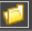

# Primo.Office.OdfOxml.Linux Package Description

The **Primo.Office.OdfOxml.Linux** package provides a set of elements for creating and editing OpenDocument format documents on the Windows platform.

## Общие сведения

**Primo.Office.OdfOxml.Linux** is a library designed for working with ODF and OOXML document formats. It offers a wide range of functions for managing content, such as inserting images, tables, and text; replacing and deleting text; working with font and background colors; searching and copying text; and exporting documents. For tables, it supports operations such as adding, copying, renaming, and deleting sheets; editing ranges and cells; inserting charts, formulas, and filters; sorting data; and updating pivot tables. The library also allows saving documents in various formats, including PDF.

### Getting Started

To install the **Primo.Office.OdfOxml.Linux** package, use the Dependency Manager in Primo RPA Studio or visit [NuGet.org](https://www.nuget.org/).

### Installation Steps

1. **Open the Dependency Manager:**
   - From the main menu of Primo RPA Studio, select `Dependency Management`.
   - Or right-click on the project panel and select "Dependencies" from the context menu.

2. In the opened window, go to the **NuGet.org** section and enter **Primo RPA** in the search bar.

3. Click the funnel icon to display the list of available libraries. Find **Primo.Office.OdfOxml.Linux** and click **Install**.

4. Click **Save**.

5. In the modal window that appears, click **Install** and then **Close** to complete the installation. The package will be added to your project.

## Documentation

For more detailed information on setting up and using **Primo.Office.OdfOxml.Linux**, visit [the documentation on our website](https://docs.primo-rpa.com).

## Library Features

The library includes the following features:

- **ODF/OXML - Documents**:
   - Add table row
   - Copy to clipboard
   - Delete text
   - Export document
   - Find text
   - Get text
   - Insert image
   - Insert table
   - Insert text
   - ODF document
   - Read table
   - Save document
   - Text background color
   - Text color
   - Write table cell

- **ODF/OXML - Tables**:
  - Sheets:
   - Add sheet
   - Copy sheet
   - Delete sheet
   - Get sheet names
   - Rename sheet
  - Append range
  - Calculate formulas
  - Change cells
  - Change font
  - Copy range
  - Delete columns
  - Delete range
  - Delete rows
  - Filter range
  - Find all
  - Find cell
  - Find First/Last Data Row
  - Insert chart
  - Insert columns
  - Insert rows
  - ODF workbook
  - Read cell
  - Read cell formula
  - Read column
  - Read range
  - Refresh pivot tables
  - Save as PDF
  - Save workbook
  - Select range
  - Sort range
  - Update chart
  - Write cell formula
  - Write to cell
   
To use an element, simply drag and drop it onto the project workspace in Primo RPA Studio.

## Usage Examples of Primo.Office.OdfOxml.Linux

### Example of Inserting Text

```csharp
Primo.Office.OdfOxml.Linux.WordApp app = Primo.Office.OdfOxml.Linux.WordApp.Init(wf, "fileName");
app.AppendText(text, [selStart]);
app.AppendText(text, bookmark);
```

### Example of Writing to a Table Cell

```csharp
Primo.Office.OdfOxml.Linux.WordApp app = Primo.Office.OdfOxml.Linux.WordApp.Init(wf, "fileName");  
app.WriteTableCell(idx, data, row, col);  
```

### Example of Inserting an Image

```csharp
Primo.Office.OdfOxml.Linux.WordApp app = Primo.Office.OdfOxml.Linux.WordApp.Init(wf, "fileName");
app.InsertPicture(pic, bookmark);
app.InsertPicture(pic, pos);
```

### Example of Refreshing a Pivot Table

```csharp
Primo.Office.OdfOxml.Linux.ExcelApp app = Primo.Office.OdfOxml.Linux.ExcelApp.Init(wf, [file]);  
app.RefreshPivotTables();  
```

### Example of Saving a Table as a PDF

```csharp
Primo.Office.OdfOxml.Linux.ExcelApp app = Primo.Office.OdfOxml.Linux.ExcelApp.Init(wf, [file]);
app.ExportToPdf(path, replaceExisting, minQuality, [start], [end]);
```

### Example of Editing a Chart

```csharp
Primo.Office.OdfOxml.Linux.ExcelApp app =  Primo.Office.OdfOxml.Linux.ExcelApp.Init(wf, "fileName");  
app.ChartSetRange(chart, "A1:D12", false);  
app.ChartSetTitle(chart, "State Chart", true);  
app.ChartSetAxTitle(chart, Model.Excel.AxisType.Category, "Height, meters", true);  
app.ChartSetAxBounds(chart, Model.Excel.AxisType.Value, -5.5, 350.25);  
app.ChartSetLegend(chart, true);  
app.ChartSetDataLabels(chart, true);  
```

## General Properties

The following properties are common across multiple elements and are defined under the **General** section:

- **Continue on exception**: The script will continue running even if an error occurs during the execution of the element.
- **Disable logging**: Allows disabling logging in the console (only for this element). This is useful, for example, if the element handles confidential data. There is also an option to enable/disable logging centrally for all new elements added to the project. To do this, go to `File > Settings > General > Elements` and set the desired value in the `Disable logging for new elements` checkbox.
- **Name**: The name of the element, which is displayed in its header and in the log. For convenience, the element name can be changed within the process, for example, when multiple identical components are used.
- **Screenshot on error**: A screenshot will be taken if an error occurs.
- **Screenshot on finish**: Allows taking a screenshot upon the element's completion. All screenshots are saved in the `.Screenshots` folder, which is automatically created inside the process folder.
- **Wait after (ms)**: Pause after the element is executed.
- **Wait before (ms)**: Adds a pause before the element is executed.

## Section "ODF/OXML - Documents"

All components listed below are added to the workspace within the **ODF document** element. This component connects to the ODF Documents application. The **ODF document** element includes the following properties:

- **Text**:  
   - Byte array — byte array of the document.  
   - Password — password for the file, if available.  
   - Password (encrypted) — protected password for the file.  
   - File path – By clicking the button , you can specify the file path in the File Explorer window.

### Component "Insert image"

This inserts an image into a Word document. The document path is specified in the **ODF document** container. By default, the image is inserted at the end of the text. To specify a different position, either the **Bookmark** or **Char index** property must be filled in. It includes the following properties:

1. **Text**:  
   - Bookmark – the name of the bookmark that defines the insertion point. If no bookmark is provided, the image is inserted at the end of the text.  
   - Image – the name of the variable that contains the image to be inserted. Required.
   - Char index – the character index for the image insertion, specified in characters. You can specify the position relative to a keyword in the text, for example. First, find the word in the document, then indicate the number of characters before or after it.

### Component "Insert table"

This component inserts a table into the document. It functions correctly only within a container. It includes the following properties:

1. **Text**:
   - Data
   - Bookmark — the name of the bookmark that defines the insertion point. If not provided, the table is inserted at the end of the text.
   - Data table

### Component "Insert text"

This component writes data into a Word document. It includes the following properties:

1. **Text**:
   - Bookmark — the name of the bookmark that defines the insertion point. If not provided, the text is inserted at the end of the document.
   - Start — the index indicating where the insertion begins.
   - Text — the data to be entered into the document.

### Component "Add table row"

This component adds a row to a table. It functions correctly only within the **ODF document** container. It includes the following properties:

1. **Text**:
   - Data — the row data. Example: `new List<string>(){"a","b"}`
   - Index — required. The table index (starting from zero).
   - DataRow — the row data. Example: `table.NewRow()`

### Component "Replace text"

This component replaces all occurrences of the original text with new text. It includes the following properties:

1. **Text**:
   - Old text
   - New text — required.

### Component "Write table cell"

This component writes text into a table cell. It functions correctly only within the **ODF document** container. It includes the following properties:

1. **Text**:
   - Data — the cell data. Example: `"string"`
   - Index — required. The table index (starting from zero).
   - Column — the column index (starting from zero).
   - Row — the row index (starting from zero).

### Component "Copy to clipboard"

This component copies text to the clipboard. It functions correctly only within the **ODF document** container. It includes the following properties:

1. **Text**:
   - Length — text length.
   - Start — text start.

### Component "Find text"

Searches for the specified text in the document. It functions correctly only within the **ODF document** container. It includes the following properties:

1. **Text**:
   - Variable — the variable used to store the index of the first occurrence of the text.
   - Variable (array) — the variable used to store an array of indices of text occurrences.
   - Text — the text to search for.

### Component "Read table"

Reads a table from the document and stores it in a variable. The file path is specified in the **ODF document** container. It includes the following properties:

1. **Output**:
   - Data — the variable used to store the read table. It differs from the **DataTable** property only by data type.
   - DataTable — the variable used to store the read table.

2. **Text**:
   - Index — required. The table index in the document.

### Component "Save document"

Saves the current state of the file. If the **File path** property is not specified, the file opened within the **ODF document** container will be saved. It includes the following properties:

1. **Text**:
   - File path – the path to the ODF file. By clicking the button , you can specify the file path in the File Explorer window.

### Component "Delete text"

Deletes text of a specified length. It functions correctly only within the **ODF document** container. It includes the following properties:

1. **Text**:
   - Length — the length of the text (default is until the end of the document).
   - Start — the index of the character where the text starts (indexing begins at zero, default value is zero).

### Component "Text background color"

Processes the background color of the text in the document. It functions correctly only within the **ODF document** container. It includes the following properties:

1. **Output**:
   - Color — variable used to save the current background color. If the fragment has multiple background colors, it is set to `System.Drawing.Color.Transparent`.
   
2. **Text**:
   - Length — the length of the text (default is until the end of the document).
   - Change color — indicates whether to change the color. Example: `true`.
   - Start — the index of the character where the text starts (indexing begins at zero, default value is zero).
   - New color — the background color to be set. Example: `System.Drawing.Color.LightBlue`.

### Component "Text color"

Processes the text color in the document. It functions correctly only within the **ODF document** container. It includes the following properties:

1. **Output**:
   - Color — variable used to save the current font color. If the fragment has multiple font colors, it is set to `System.Drawing.Color.Transparent`.
   
2. **Text**:
   - Length — the length of the text (default is until the end of the document).
   - Change color — indicates whether to change the color. Example: `true`.
   - Start — the index of the character where the text starts (indexing begins at zero, default value is zero).
   - New color — the font color to be set. Example: `System.Drawing.Color.LightBlue`.

### Component "Export document"

Exports the ODF file to the specified format. Currently, only PDF export is supported. It includes the following properties:

1. **Text**:
   - File path — by clicking the button , you can specify the file path in the File Explorer window.
   - Format — format type. Currently, only PDF is supported.

### Component "Get text"

Reads data from the document and saves the result into a variable. The file path is specified in the **ODF document** container. It includes the following properties:

1. **Text**:
   - Length — the length of the text selection.
   - Start — the start of the text selection.
   - Variable — the variable used to store the reading results. Required.

## Section "ODF/OXML - Tables"

All the components listed below are added to the workspace inside the **ODF workbook** element. This element establishes a connection to an application that works with ODF spreadsheets. The file path for the spreadsheet is specified in the element's properties. If the file does not exist, a new one will be created. The **ODF workbook** element includes the following properties:

1. **Text**:
   - Byte array — the byte array of the document.
   - Password — the file's password, if applicable.
   - Password (encrypted) — the encrypted password of the file.
   - Check file — determines whether to check for the existence of the specified file. By default, no check is performed.
   - File path — by clicking the button , you can specify the file path in the File Explorer window.

---

### Subsection "Sheets"

#### Component "Add sheet"

Creates a new sheet in the ODF spreadsheet. The file path is specified in the **ODF workbook** container. It includes the following properties:

1. **Table**:
   - Index — the ordinal number of the sheet. Numbering starts from zero.
   - Name — the name of the new sheet. Required.

#### Component "Copy sheet"

Copies a sheet for insertion into the source file or an external ODF document. The file path is specified in the **ODF workbook** container. It includes the following properties:

1. **Table**:
   - Sheet — the name of the sheet to copy. Required.
   - Index — the ordinal number of the sheet to copy. Numbering starts from zero.
   - New sheet — the name of the sheet to insert. Required.
   - File — the path to the external ODF file. If no path is specified, the copied sheet will be inserted into the source file. By clicking the button , you can specify the file path in the File Explorer window.

#### Component "Rename sheet"

Renames a sheet in the ODF document. The file path is specified in the **ODF workbook** container. It includes the following properties (required):

1. **Table**:
   - Index — the ordinal number of the sheet you want to rename. Numbering starts from zero.
   - Name — the new name of the sheet.

#### Component "Get sheet names"

Retrieves the list of sheets in the ODF document. The result is saved into a variable. The file path is specified in the **ODF workbook** container. It includes the following properties:

1. **Text**:
   - Variable — the name of the variable that will store the list of sheets.

#### Component "Delete sheet"

Deletes a sheet in the document by its ordinal number or name. The file path is specified in the **ODF workbook** container. It includes the following properties (required):

1. **Table**:
   - Index — the ordinal number of the sheet to delete. Numbering starts from zero.
   - Name — the name of the sheet to delete.

---

### Component "Insert chart"

Creates a chart on the spreadsheet. The file path is specified in the **ODF workbook** container. It includes the following properties:

1. **Output**:
   - Variable — a variable for storing a reference to the inserted chart.
2. **Layout**:
   - Height — the height of the chart in pixels.
   - Top — the top offset in pixels.
   - Left — the left offset in pixels.
   - Width — the width of the chart in pixels.
3. **Table**:
   - Vertical range — determines whether to display the series based on a row or column range of cell values.
   - Range — the data range (A1:D12). If the symbol "*" is specified, the entire sheet will be used. Example: `@"A1:L15"`.
   - Sheet index — numbering starts from zero, with the default value being zero if the sheet name is not specified.
   - Sheet name — the name of the sheet (works only if the sheet index is not specified).
   - Type — [chart type](https://reference.aspose.com/cells/net/aspose.cells.charts/charttype/). Example: Aspose.Cells.Charts.ChartType.Column.

### Component "Insert columns"

Inserts columns into the ODF spreadsheet. The file path is specified in the **ODF workbook** container. It includes the following properties:

1. **Table**:
   - Index — the ordinal number of the column to the left of which the new column will be added. Numbering starts from zero. If not specified, the insertion is performed at the end of the sheet.
   - Sheet index — the ordinal number of the sheet with the table.
   - Quantity — the number of columns to insert. The default is 1. Required.
   - Sheet name — the name of the sheet with the table. 

### Component "Insert rows"

Inserts rows into the ODF spreadsheet. The file path is specified in the **ODF workbook** container. It includes the following properties:

1. **Table**:
   - Index — the ordinal number of the row after which the new rows will be inserted. If Index is not specified, the insertion is performed at the end of the sheet.
   - Sheet index — the ordinal number of the sheet with the table.
   - Quantity — the number of rows to insert. The default is 1. Required.
   - Sheet name — the name of the sheet with the table.

### Component "Select range"

Selects a range of cells in the ODF spreadsheet. The file path is specified in the **ODF workbook** container. It includes the following properties:

1. **Table**:
   - Range — the range of cells to select. Required.
   - Sheet index — the index of the sheet with the table.
   - Sheet name — the name of the sheet with the table.

### Component "Write to cell"

Writes data to a cell in the ODF spreadsheet. The file path is specified in the **ODF workbook** container. It includes the following properties:

1. **Table**:
   - Data — the data to be entered into the cell. A string variable can be used. Required.
   - Sheet index — the index of the sheet with the table.
   - As text — determines whether the value should be inserted as text.
   - Sheet name — the name of the sheet with the table.
   - Cell — the cell identifier. Required.

### Component "Append Range"

Writes data to a range of cells in the ODF spreadsheet. The file path is specified in the **ODF workbook** container. It includes the following properties:

1. **Table**:
   - Entire row — determines whether to add the entire row. By default, this is not used. This setting should be applied if a filter is set on the page.
   - Range — the range for cell data entry. Required.
   - Add headers — determines whether to add column headers to the table. By default, this is not used.
   - Sheet index — the ordinal number of the sheet. Indexing starts from 0. If Index is specified, the sheet in the target file may be renamed.
   - As text — determines whether to insert the value as text. By default, this is not used. If the checkbox is checked, the "Strong type" property should be disabled.
   - Direction — the direction for shifting cells. Possible values:
      - Down — downwards. Default value.
      - Right — to the right.
   - Overwrite — determines whether to overwrite existing data. By default, this is not used.
   - Variable (information) — variable for storing data containing information about the cells.
   - Variable (table) — variable for storing data in table format.
   - Variable (text) — variable for storing textual data.
   - Expand range — determines whether to automatically expand the range to fit the size of the data. By default, this is not used.
   - Create sheet — creates a sheet if it does not exist.
   - Sheet name — the name of the sheet with the specified range.
   - Strong type — indicates strict typing for tables. Strong type prevents data format changes when writing to the table. Disabling this parameter may result in numeric formats being incorrectly converted to strings.

### Component "Write cell formula"

Writes a formula to a cell in the ODF spreadsheet. The file path is specified in the **ODF workbook** container. It includes the following properties:

1. **Table**:
   - Sheet index — the index of the sheet with the table.
   - Sheet name — the name of the sheet with the table.
   - Formula — the formula to enter into the cell.
   - Cell — the cell identifier. Required.

### Component "Change font"

Changes the font of a range of cells in an ODF spreadsheet. The file path is specified in the **ODF workbook** container. It includes the following properties:

1. **Table**:
   - Range — the range of cells. Required.
   - Sheet index — the index of the sheet with the table.
   - Italic — applies italic formatting.
   - Underline — applies underline formatting.
   - Bold — applies bold formatting.
   - Size — the font size.
   - Sheet name — the name of the sheet with the table.
   - Color — the font color. Example: `System.Drawing.Color.Black`.

### Component "Change cells"

Modifies the format of cells in an ODF spreadsheet. The file path is specified in the **ODF workbook** container. It includes the following properties:

1. **Table**:
   - Range — the range of cells. Required.
   - Sheet index — the index of the sheet with the table.
   - Sheet name — the name of the sheet with the table.
   - Border type — the type of border for the cells in the specified range. Possible values:
      - Keep — use the border type set in the document.
      - None — no border.
      - Around — outer borders.
      - Full — all borders.
      - Left — left border.
      - Right — right border.
      - Top — top border.
      - Bottom — bottom border.
   - Border thickness — the thickness of the cell borders. Possible values:
      - Thin — thin border. Default value.
      - Medium — medium thickness.
      - Thick — thick border.
   - Border color — the color of the cell borders in the range. Example: `System.Drawing.Color.Black`.
   - Cells color — the color of the cells in the range. Example: `System.Drawing.Color.Black`.

### Component "Copy range"

Copies a range of cells in an ODF spreadsheet to another sheet. The copy operation can be performed within the source file or into an external file. The path to the source file is specified in the **ODF workbook** container. The path to the external file is specified in the properties of the **Copy Range** element. It includes the following properties:

1. **Table**:
   - Source range — the range of cells to copy. You can specify the range precisely, e.g., `A1:D12`, or use the symbol `*` instead of a column or row number, e.g., `A1:*12` or `A1:D*`. Required.
   - Target range — the range of cells for pasting data. For example, `A1` or `A1:D12`. Required.
   - Source sheet index — the index of the source sheet. Indexing starts from zero.
   - Target sheet index — the index of the target sheet. Indexing starts from zero.
   - Workbook path — the path to the external file where the copied range should be pasted. If not specified, the range will be pasted within the source file.
   - Source sheet — the name of the source sheet.
   - Target sheet — the name of the target sheet.
   - Format — determines the format in which to copy the data. Available values:
      - All — copies all values, formats, and formulas from the range. Default value.
      - Values — copies only values. Cell formats and formulas are ignored — formulas are replaced with their results.
      - Formulas — copies values and formulas. To ensure formula values display correctly when pasted, add the **Recalculate Formulas** component after copying the range.
      - Formats — copies only cell formats, fonts, and colors. Values and formulas are ignored.

### Component "Find First/Last Data Row"

Helps determine the boundaries of data within a specified column. The file path is specified in the **ODF workbook** container. It includes the following properties:

1. **Output**:
   - End of data range — the name of the variable to store the end of the data range.
   - Start of data range — the name of the variable to store the start of the data range. Essentially, the number of the first row with data.
2. **Table**:
   - Range — the range for reading cells. For example, `A1:D12`. If the symbol `*` is specified, the entire sheet will be read. If not specified, the selected range will be read.
   - Last row index — the criteria for determining the number of the last row. Possible values:
      - First Empty Row (default) — if selected, the last row is considered to be the first empty row.
      - Last Populated Row — returns the number of the last row containing data.
   - Sheet index — indexing starts from zero. If a sheet name is provided, the index can be omitted.
   - Blank rows to skip — allows setting the number of consecutive blank rows permitted in the data before determining that the range has ended. By default, blank rows in data are not permitted.
   - First row index offset — the number of rows to add to the number of the first row. For example, when there are hidden rows in the table.
   - Last row offset — the number of rows to subtract from the index of the last row.
   - Data column — the address of the column in which to find data. Required.
   - Sheet name — the name of the sheet. If the index is specified, the name can be omitted.
   - Headers row — determines if the first row contains table headers. By default, the checkbox is not checked — it is assumed that the first row does not contain headers.

### Component "Find all"

Searches for a specified value on a sheet. The file path is specified in the **ODF workbook** container. It includes the following properties:

1. **Output**:
   - Variable — the name of the variable to store the search results.
2. **Table**:
   - Value — the value to search for. Required.
   - Sheet index — the index of the sheet. Indexing starts from zero.
   - Sheet name — the name of the sheet.

### Component "Find cell"

Searches for a cell containing the specified text within a range of cells on a sheet. Works correctly only in the **ODF workbook** container. It includes the following properties:

1. **Output**:
   - Variable — the name of the variable to store the search results.
2. **Table**:
   - Range — the range of cells to read, e.g., `A1:D12`. If the symbol `*` is specified, the entire sheet will be read.
   - Value — the text to search for. Required.
   - Sheet index — the index of the sheet. Indexing starts from zero.
   - Sheet name — the name of the sheet.

### Component "Refresh pivot tables"

Updates pivot tables. Works correctly only in the **ODF workbook** container.

### Component "Calculate formulas"

Recalculates formulas in tables. Works correctly only in the **ODF workbook** container.

### Component "Update chart"

Edits a chart in a table. Works correctly only in the **ODF workbook** container. It includes the following properties:

1. **Range**:
   - Vertical range — displays the row based on the range of cell values by row or column.
   - Range — the new range of cells. If not specified, the selected range will be used. If the symbol `*` is specified, the entire sheet will be used. Example: `A1:D12`.
   - Change range — whether to change the chart's range of cells. Default is not used.
2. **Title**:
   - Title — the new text for the chart title.
   - Change title — whether to change the chart title. Default is not used.
   - Title visible — whether to display the chart title. Default is not displayed.
3. **Legend**:
   - Change legend visibility — whether to change the visibility of the chart legend. Default is not used.
   - Legend visible — whether to display the chart legend. Default is not displayed.
4. **Data label**:
   - Change data labels visibility — whether to change the visibility of data labels. Default is not used.
   - Data labels visible — whether to display data labels on the chart. Default is hidden.
5. **Axis**:
   - Axis title — the text for the axis title.
   - Change axis bounds — whether to change the axis bounds.
   - Change axis title — whether to change the axis title.
   - Max bound — the maximum bound.
   - Min bound — the minimum bound.
   - Axis title visible — whether the axis title is visible.
   - Axis type — the type of the editable axis:
      - Value
      - Category
6. **Table**:
   - Chart index — the index of the chart.
   - Sheet index — the index of the sheet.
   - Variable — the variable storing the chart reference.
   - Sheet name — the name of the sheet.

### Component "Sort range"

Sorts a range of cells in a table. Works correctly only in the **ODF workbook** container. It includes the following properties:

1. **Table**:
   - Range — the range of cells to be sorted. If not specified, the selected range will be sorted. Required.
   - Sheet index — the index of the sheet with the table.
   - Order — the sort direction. Required.
      - ascending — in ascending order; default direction.
      - descending — in descending order.
   - Sheet name — the name of the sheet with the table.

### Component "Save workbook"

Saves the file of tables. If the file path is not specified, the file of the current **ODF workbook** container will be saved. Works correctly only in the **ODF workbook** container. It includes the following properties:

1. **Table**:
   - File path — specify the file path using the button  in the file explorer.

### Component "Save as PDF"

Saves the ODF file in PDF format. Works correctly only in the **ODF workbook** container. It includes the following properties:

1. **Table**:
   - Replace existing — determines whether to overwrite the existing PDF file. By default, the checkbox is not checked, and the file will not be overwritten.
   - First sheet index — the index of the first page to export. Indexing starts from zero. If not specified, the default value is 0 — the first page of the workbook.
   - Last sheet index — the index of the last page to save. If not specified, the default value is the value specified in the "First sheet index" property.
   - Min. quality — determines whether to save the output file in minimal quality. By default, the checkbox is unchecked, and the file will be saved in high quality.
   - Path — the path to save the PDF file. Specify the file path using the button  in the file explorer.

### Component "Delete range"

Deletes a range of cells from the ODF table. Works correctly only in the **ODF workbook** container. It includes the following properties:

1. **Table**:
   - Range — the range of cells to delete. Example: `A1:D12`. If not specified, the selected range will be deleted. Required.
   - Sheet index — the index of the sheet with the table.
   - Sheet name — the name of the sheet with the table.
   - Cells only — indicates whether to delete only the cells in the range, not the entire rows and columns.

### Component "Delete columns"

Deletes selected columns from the ODF table. Works correctly only in the **ODF workbook** container. It includes the following properties:

1. **Table**:
   - Index — the index of the column to delete. Default is 1. Required.
   - Sheet index — the index of the sheet. Indexing starts from zero.
   - Quantity — the number of columns to delete. Default is 1. Required.
   - Sheet name — the name of the sheet with the table.

### Component "Delete rows"

Deletes selected rows from the ODF table. Works correctly only in the **ODF workbook** container. It includes the following properties:

1. **Table**:
   - Index — the index of the row to delete. Default is 1. Required.
   - Sheet index — the index of the sheet. Indexing starts from zero.
   - Quantity — the number of rows to delete. Default is 1. Required.
   - Sheet name — the name of the sheet with the table.

### Component "Filter range"

Sets a filter for a range of cells in a table. Works correctly only in the **ODF workbook** container. It includes the following properties:

1. **Table**:
   - Range — the range of cells. Example: `A1:D12`. Required.
   - Column index — the index of the column to filter (zero-based; default value is 0).
   - Sheet index — the index of the sheet (zero-based; default value is 0 when the sheet name is not specified).
   - Sheet name — the name of the sheet (works only when the sheet index is not specified).
   - Filter — the filter values. Required.

### Component "Read cell formula"

Reads a formula from a cell. Works correctly only in the **ODF workbook** container. It includes the following properties:

1. **Output**:
   - Formula — the formula obtained from the cell. Required.
   - Output language — the language for outputting the formula. Required.
2. **Table**:
   - Sheet index — the index of the sheet, starting from zero.
   - Sheet name — the name of the sheet with the cell.
   - Cell — the identifier of the cell. Required.

### Component "Read range"

Reads data from a range of cells in the ODF table. Works correctly only in the **ODF workbook** container. It includes the following properties:

1. **Output**:
   - Variable (info) — variable for storing additional information read from the cells, e.g., font color.
   - Variable (table) — variable for storing results in tabular form.
   - Variable (text) — variable for storing results as text values.
   - Headers row — indicates whether the first row contains headers.
   - Use table cell field types — indicates whether to consider the cell types in the table.
2. **Table**:
   - Range — the range of cells to read. Example: `A1:D12`. If not specified, the selected range will be read. If `*` is specified, the entire sheet will be read.
   - Sheet index — the index of the sheet, starting from zero.
   - Sheet name — the name of the sheet.
   - Date format — explicit date format specification.

### Component "Read cell"

Reads data from a cell on a sheet. Works correctly only in the **ODF workbook** container. It includes the following properties:

1. **Output**:
   - Data — the name of the variable where the read result will be stored. Required.
2. **Table**:
   - Sheet index — the index of the sheet, starting from zero.
   - Sheet name — the name of the sheet with the cell.
   - Cell — the identifier of the cell to read. Required.

### Component "Read column"

Reads data from a column in the ODF table. Works correctly only in the **ODF workbook** container. It includes the following properties:

1. **Output**:
   - Data — the name of the variable where the column data will be stored.
2. **Table**:
   - Sheet index — the index of the sheet, starting from zero.
   - Sheet name — the name of the sheet with the column.
   - Cell — the identifier of the starting cell. Required.

## Обратная связь

Если у вас возникли вопросы или предложения, пожалуйста, свяжитесь с нами по адресу [support@primo-rpa.ru](mailto:support@primo-rpa.ru).
